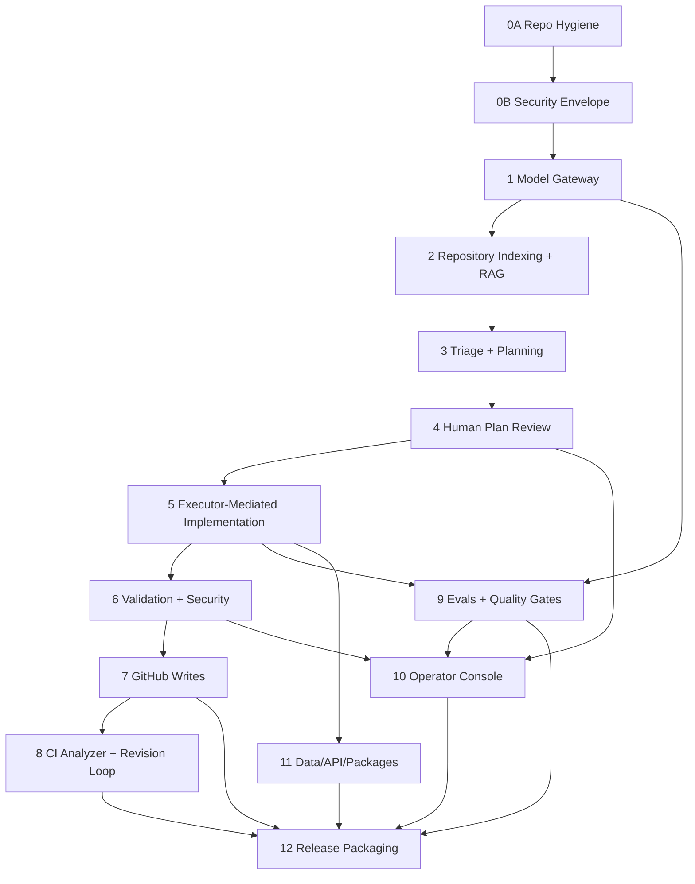

# RepoPilot AI Comprehensive Improvement Plan And Execution Ledger

> Updated from critique assessment, blueprint traceability, current-code inspection, current build verification, and the original v2 visual architecture blueprint - 2026-06-02

---

## Executive Summary

RepoPilot has moved beyond scaffolding into a credible production-style control plane. The current workspace includes FastAPI routes, Docker Compose, PostgreSQL/pgvector schema, Redis/Celery queueing, GitHub webhook verification, signed sessions, repository indexing, a persisted run state machine, policy checks, sandbox execution, security scanning, audit logs, a model gateway, executor-mediated implementation, a guarded GitHub writer path, CI analysis, fixture-backed evals, and a broad operator dashboard.

This document is now both the improvement plan and the execution ledger. The May 31 update makes the plan more explicit: it should be possible to execute RepoPilot phase by phase, verify each gate, and know exactly which blueprint claim is still local-only, credential-blocked, or production-proven.

It separates three categories that were previously blurred:

- **Implemented locally:** code exists, tests pass, and local verification has been run.
- **Implemented but not production-proven:** code path exists, but needs live GitHub App credentials, provider keys, or a demo repository smoke test.
- **Still remaining:** planned production hardening, release packaging, credentialed smoke tests, executable benchmark proof, browser QA evidence, and final release assets.

The product is closer to the envisioned RepoPilot AI coding agent, but several production proof points still require live-provider or credentialed smoke evidence before v1.0 claims are defensible:

- Triage and planning route through the model gateway with deterministic fallback, but live-provider quality still needs evaluation.
- Embeddings route through the gateway with deterministic mock vectors, but provider-backed embedding quality still needs a credentialed run.
- Implementation now uses model-proposed workspace tool calls through `ToolExecutor`, but live model patch quality still needs benchmark proof.
- Draft PR creation still defaults to explicit local-record mode; real branch/commit/PR/client methods are implemented but require user-provided GitHub App credentials and a demo-repo smoke test.
- `/repopilot approve|reject|revise|status|stop` comment commands now use GitHub collaborator permission mapping, but credentialed installation-token evidence is required before production claims.
- Eval reports are fixture-backed with per-task outcomes, executable fixture repositories, observed plan/patch-quality scoring, human edit distance, and provider-comparison ranking, but full model-generated patch attempts and CI-backed eval runs remain future hardening.

This plan is worth implementing, but it must be implemented in a safer order than the earlier draft. Real code generation and GitHub writes must remain locked until repo hygiene, authentication, model tracing, plan hash binding, approved-path diff controls, validation, security checks, and eval fixtures are in place.

The controlling execution idea is:

```text
build the control plane first -> prove safe planning -> prove safe patching -> prove real GitHub writes -> prove quality with evals -> package release evidence
```

---

## Current-State Evidence

| Area | Current Evidence | Impact |
|---|---|---|
| Triage | `apps/api/app/services/triage.py` now has deterministic triage plus `triage_with_model`, a redacting `TriagePromptBuilder`, gateway trace recording, confidence scores, schema fallback, missing-info checks, and pre-model prompt-injection blocking. | Model path is present and safe, but live-provider triage quality still needs benchmark evaluation. |
| Planning | `apps/api/app/services/planning.py` now uses `PlanningPromptBuilder` and `ModelGateway.complete_json` with deterministic fallback. Prompt payloads include redacted issue metadata, cited context chunks with score/freshness evidence, policy constraints, and expected plan evidence. Plans include summary, intended changes, validation strategy, assumptions, and context citations. | Planning is gateway-mediated and review-ready, but live model quality, plan revision regeneration, and fixture benchmark proof are still pending. |
| Retrieval | `apps/api/app/services/repo_indexer.py` routes chunk and query embeddings through `ModelGateway.embed`, normalizes vectors to the existing pgvector dimension, stores embedding provider/model/dimensions on chunks, writes dedicated `repository_indexes` metadata through migration `0005_repository_index_metadata`, marks stale indexes by embedding and chunker version, chunks Python/TypeScript/JavaScript/Go/Rust/Java/Markdown around symbols/headings where practical, classifies source/test/doc/config chunks, rejects symlink escapes, and skips `.secrets`, secret-like files, generated dependency trees, generated bundle files, and private-key suffixes before chunk storage. | Context search is now gateway-mediated, cited, safer, and metadata-backed; live provider embeddings and retrieval-quality benchmarks are still pending. |
| Implementation | `apps/api/app/services/implementation_agent.py` creates an isolated workspace through `workspace.create_run_copy`, asks the model for bounded workspace write tool calls, captures diff/patch hash, normalizes pytest commands into the sandbox's active Python runtime, and validates through the sandbox validation tool. | Executor-mediated codegen path is in place; live model quality and full issue-to-patch benchmark proof are still pending. |
| Tool boundary | `apps/api/app/services/tools/registry.py` exposes model-facing tools and enforces approved-plan/workspace gates, typed block reasons, redacted persisted tool output, approved-plan hash matching, and approved write paths before mutation. | Strong foundation; Semgrep and dependency-audit adapters now run controlled commands when enabled and fail closed when required tools are unavailable. |
| Artifact storage | `apps/api/app/services/artifacts.py`, `ArtifactRecord`, migration `0004_artifact_records`, `GeneratedPatch.diff_artifact`, and `ValidationResult.log_artifact` now externalize patch diffs, validation logs, and large tool outputs behind `local://artifacts/...` references with SHA-256 and byte-size metadata. | The object-store-ready contract exists locally; cloud object storage and signed download URLs remain future deployment work. |
| Authorization | `apps/api/app/services/authorization.py` provides role and object-access helpers for repositories, issues, plans, runs, PRs, and security findings; key state-changing routes use the helpers. | Good single-tenant authorization baseline; credentialed GitHub collaborator evidence still needs smoke testing. |
| GitHub writes | `GitHubApiClient` now includes branch/ref/blob/tree/commit/PR/comment/check-run/check-annotation/workflow-log/collaborator methods behind `GITHUB_WRITES_ENABLED` and credentials. | Real client path exists; end-to-end demo repo write proof is pending credentials. |
| Credential readiness | `.env.example`, Docker Compose, `IntegrationReadinessService`, `/settings/github/app`, `/settings/github/app/verify`, `/settings/readiness`, and the dashboard settings screen now distinguish missing credentials, present-but-unverified credentials, verified read-only GitHub mode, unverified write mode, verified write mode markers, mock model mode, unverified live model mode, and verified live model mode. | R2 is implemented locally; live verification still requires user-provided GitHub App credentials, installation ID, provider keys, and a demo repository. |
| Scanner posture evidence | `.github/workflows/codeql.yml`, `scripts/security_scanner_snapshot.py`, and `make security-scanner-snapshot` now capture external scanner enablement, dependency manifest coverage, CodeQL workflow presence, tool availability/version evidence, and explicit disabled/blocked reasons under `Docs/release-artifacts/`. | R6 release evidence is stronger locally, but Semgrep, dependency audit, and CodeQL still need enabled runtime/CI proof before production security claims are complete. |
| Credential handoff | `Docs/CREDENTIAL_HANDOFF.md` lists the exact GitHub App, OAuth, model, scanner, smoke-test, evidence, and stop-condition requirements for live proof. | The next credentialed step is executable once secrets and a disposable demo repository are provided. |
| Comment commands | `apps/api/app/services/github_ingestion.py` maps `/repopilot approve|reject|revise|status|stop` through `GitHubPermissionService` before applying actions. | Permission path exists; credentialed installation-token proof is pending. |
| Draft PRs | `apps/api/app/services/draft_pr.py` creates local DB records by default and can call the real GitHub writer when write mode and credentials are present. | Local demo remains safe; real write smoke test is pending. |
| Evals | `apps/api/app/services/eval_runner.py` loads `packages/evals/benchmark_tasks.json`, validates 31 fixture tasks, delegates fixture repository/file/command checks to `repopilot_evals.FixtureVerifier`, records per-task outcomes, fixture repository pass rate, fixture file coverage, category pass rates, quality gates, optional observed plan-quality scores from `model_config.observed_plan_results`, optional observed patch-quality scores from `model_config.observed_task_results`, human edit distance when generated/reference diffs are supplied, and provider comparison results from `model_config.provider_eval_results`. `repopilot_evals.BenchmarkReportBuilder` and `make eval-report` now write Markdown/JSON local evidence under `Docs/eval-reports/`; `ProviderPlanningEvalRunner`, `make provider-planning-eval`, and `.github/workflows/provider-planning-eval.yml` can collect planning-only provider evidence from an environment or GitHub Actions secret using the shared OpenAI-compatible, Anthropic, or Gemini provider adapter layer. | Executable local fixture proof plus plan/context/patch-quality, human-edit-distance, provider-comparison scoring, a local baseline report, and local/GitHub provider planning harnesses exist; full model-generated patch runs, retrieval-provider benchmarks, and credentialed provider-backed patch comparisons are pending. |
| Model gateway | `apps/api/app/services/model_gateway.py` provides mock-first completions, structured JSON validation, deterministic mock embeddings, budget checks, capped transient provider retries, native OpenAI-compatible/Anthropic Messages/Gemini GenerateContent completion adapters, prompt/response hashes, provider/mode-aware LLM trace persistence, and trace metadata for citations/embedding dimensions. | Central path exists; provider-backed embeddings and credentialed provider comparisons still need production proof. |
| Dashboard | `apps/web/app/operator-console.tsx` is a broad operator console with activity, settings, security lifecycle actions, runs, PRs, metrics, plan approval/rejection/revision, CI revision plans, and eval task outcomes. Release screenshots are now captured under `Docs/release-artifacts/` for dashboard desktop/mobile, plan review, agent runs, run trace, pull requests, security, evaluations, and settings; local plan-to-PR and governance visual-flow GIFs are generated with `make release-gifs`; the mobile shell now uses a horizontal top rail instead of clipping content behind a fixed sidebar. | Strong UI base, but live-provider/GitHub write states still depend on credentials; credentialed live-mode screenshots remain pending. |
| Repo hygiene | Git has been initialized, ignore rules/root governance files have been added, `Docs/SOURCE_BOUNDARY_DECISIONS.md` records the `README 2.md` removal decision, the stale duplicate README has been removed from the source boundary, `scripts/source_boundary_manifest.py` plus `make source-boundary-manifest` now hash non-ignored candidate files, `scripts/release_hygiene.py` plus `make release-hygiene` now generate source-boundary reports under `Docs/release-artifacts/`, and the baseline has been pushed to GitHub with green CI. `.DS_Store` files are ignored but can still be regenerated locally by Finder. | Release gate is mostly addressed; keep source-boundary evidence clean after each verification run and document private-repo CodeQL gating until GitHub code scanning is available. |
| Docker build hygiene | `.dockerignore` now excludes `.secrets`, `apps/api/.secrets`, generated web artifacts, dependency folders, docs/images, and local tool artifacts. | Baseline is corrected; CI should enforce it so secrets/artifacts do not regress into build context. |
| Local runtime platform | Docker Compose now runs API, web, worker, beat, Postgres, and Redis together. Web dev caches are isolated through named volumes for `node_modules` and `.next`; API/worker/beat share `agent_workspaces` for sandbox cleanup and `agent_artifacts` for artifact-backed evidence. `make deployment-smoke` now writes local runtime API/web smoke evidence under `Docs/release-artifacts/`. | Local runtime proof is stronger, but credentialed GitHub/model proof and production cloud/VM deployment proof are still pending. |

---

## Verified Local Evidence

The following verification evidence reflects the latest implementation sweep and should be refreshed whenever this plan is updated:

| Check | Command | Result |
|---|---|---|
| API syntax/import check | `uv run --with-requirements apps/api/requirements.txt python -m compileall apps/api/app packages/shared_contracts/repopilot_contracts packages/policy_engine/repopilot_policy_engine packages/evals/repopilot_evals scripts apps/api/alembic/versions` | Passed. |
| API tests | `uv run --with-requirements apps/api/requirements.txt python -m pytest apps/api/tests` | Passed: `171 passed`, `1 warning` from Starlette/httpx TestClient deprecation. |
| Alembic head check | `docker exec repopilot-api-1 alembic current` | Passed: `0006_llm_trace_metadata (head)`. |
| Fresh database migration verification | `make migration-verify` with local placeholder env vars | Passed: created a temporary PostgreSQL database, ran `upgrade head -> downgrade base -> upgrade head` through `0001_core_schema`, `0002_security_lifecycle`, `0003_plan_run_link`, `0004_artifact_records`, `0005_repository_index_metadata`, and `0006_llm_trace_metadata`, then dropped the database. |
| Docker Compose config | `POSTGRES_PASSWORD=... REDIS_PASSWORD=... GITHUB_WEBHOOK_SECRET=... SESSION_SECRET_KEY=... docker compose config --quiet` | Passed. |
| Package boundary install/import check | `python -m pip install --no-deps --no-build-isolation --target /private/tmp/repopilot-package-check packages/shared_contracts packages/evals packages/policy_engine packages/llm_client packages/github_client` plus imports from that target | Passed, including `ArtifactReference` from shared contracts. |
| Runtime services | `docker ps --filter name=repopilot --format 'table {{.Names}}\t{{.Status}}\t{{.Ports}}'` and `make deployment-smoke` | Passed: API, web, worker, beat, Postgres, and Redis are running locally; worker logs register `repopilot.workspace.cleanup`; beat logs show the Celery scheduler started against Redis; local runtime smoke passed against API health and the web console. |
| API health | `curl -sS --max-time 8 http://127.0.0.1:8000/health` | Passed: returned `status=ok`, `service=repopilot-api`, `environment=local`. |
| Operator console HTTP smoke | `curl -sS --max-time 8 http://127.0.0.1:3001/` plus label grep for primary console surfaces | Passed: rendered SSR HTML and exposed expected labels including Dashboard, Repositories, Issues, Agent Runs, Pull Requests, Security, Evaluations, Settings, Activity, GitHub, and Model. |
| Artifact storage runtime mount | `docker inspect repopilot-api-1 --format '{{json .Mounts}}'` | Passed: API mounts the named Docker volume `repopilot_agent_artifacts` at `/tmp/repopilot-artifacts`; API, worker, and beat share the same artifact root through Compose. |
| Web typecheck | `docker exec repopilot-web-1 sh -lc 'npm run typecheck'` | Passed. |
| Web production build | `docker exec repopilot-web-1 sh -lc 'npm run build'` | Passed against the live bind-mounted source after the responsive CSS fix. |
| Source-boundary manifest | `make source-boundary-manifest` | Passed: generated `Docs/release-artifacts/source-boundary-manifest.md`/`.json` with `319` non-ignored candidate files and aggregate manifest hash evidence. |
| Credential readiness snapshot | `make readiness-snapshot` | Passed: captured redacted running-app readiness under `Docs/release-artifacts/credential-readiness-snapshot.md`/`.json`, showing `model_mode=live_model_verified`, `github_mode=missing_credentials`, and GitHub writes disabled. |
| Security scanner snapshot | `make security-scanner-snapshot` | Passed: generated `Docs/release-artifacts/security-scanner-snapshot.md`/`.json` with local scanner posture, dependency manifests, CodeQL workflow status, installed-tool availability, and explicit external-scanner disabled/blocked reasons. |
| Browser visual QA | In-app Browser at `http://localhost:3001/`, default desktop viewport, 390x844 mobile viewport, and `make release-gifs` | Passed for dashboard shell after responsive fix and key desktop operator surfaces. Repositories view and repository detail now render index status, chunker, and fingerprint metadata; pre-`0005` indexes correctly show unavailable chunker/fingerprint until reindexed. Saved screenshots for dashboard, plan review, agent runs, run trace, pull requests, security, evaluations, settings, and a pre-fix mobile comparison under `Docs/release-artifacts/`. Generated local plan-to-PR and governance GIF evidence plus Markdown/JSON manifests under `Docs/release-artifacts/`. |
| Web dependency audit | `cd apps/web && npm audit --audit-level=moderate` | Passed: `0 vulnerabilities`. |
| Generated artifact hygiene | `git check-ignore -v apps/web/node_modules apps/web/.next` and `find apps/web -maxdepth 1 \( -name '.next' -o -name 'node_modules' \) -print` | Source-ignore gate passed: live Docker dev mode intentionally creates ignored ACL-protected mount-point directories at `apps/web/node_modules` and `apps/web/.next`; the container mounts them to named volumes `web_node_modules` and `web_next`. Stop the web service before a final source-boundary scan if a physically absent mount point is required. |
| Stale overclaim scan | `rg -n "Phase 9 MVP|synthetic pytest|not implemented yet|GitHub sender permission checks are not connected|local aggregate|future authenticated client|does not implement" README.md Docs packages apps/api/app/services apps/web/app/operator-console.tsx -g '*.md' -g '*.py' -g '*.tsx' -g '!Docs/IMPROVEMENT_PLAN.md'` | Passed after wording cleanup. |

### Evidence Limitations

The checks above prove the local build and mock-safe paths. They do not prove:

- Live GitHub App installation-token behavior.
- Real branch, commit, draft PR, and issue-comment writes against a demo repository.
- Live LLM provider response quality.
- Live embedding quality with provider-backed vector search.
- External Semgrep, dependency-audit, or CodeQL execution in a production CI environment.
- Real cloud deployment behavior, backup behavior, or production secret-store behavior.
- Full browser visual QA across all release-critical flows. This session captured core static screenshots, generated local visual-flow GIFs, and fixed a mobile clipping issue, but live credentialed states and post-credential write/CI flows still need to be captured.

---

## Comprehensive Blueprint-Aligned Master Plan

This section is the authoritative execution plan. The later R-series items describe the remaining gaps from the current build; the phase plan below describes the complete target architecture from the blueprint and the order in which the system should be executed to completion.

### Execution Principles

1. **Prove control before autonomy.** RepoPilot can read, reason, plan, and explain before it is allowed to write code.
2. **Keep model behavior behind contracts.** LLM calls must return typed results through the gateway, and all actions must pass through audited services or `ToolExecutor`.
3. **Preserve human approval as a hard gate.** No implementation tool can mutate an isolated workspace until an approved plan hash matches the run.
4. **Treat local mode and live mode as different risk classes.** Local records, mock models, mock embeddings, and disabled scanners must be labeled clearly in API responses, dashboard badges, and release docs.
5. **Make every production claim evidence-backed.** A feature is not production-proven until it has local tests plus either credentialed GitHub proof, live provider proof, executable eval proof, browser QA proof, or deployment proof as appropriate.
6. **Keep release packaging honest.** README, screenshots, demo scripts, and case-study claims must match actual verified behavior.

### Program Tracks

RepoPilot should be completed through four coordinated tracks. These tracks can run in parallel only when their dependencies are satisfied.

| Track | Phases | Purpose | Can Run In Parallel With |
|---|---|---|---|
| Control plane and safety | 0A, 0B, 1, 11 | Source boundary, auth, budget, redaction, typed contracts, package boundaries. | Dashboard polish after API contracts stabilize. |
| Agent intelligence | 2, 3, 4, 5 | Retrieval, triage, planning, approval, executor-mediated patching. | Evals after fixture contracts exist. |
| Delivery loop | 6, 7, 8 | Validation, scanners, GitHub writes, CI ingestion, revision loop. | Release docs once smoke evidence exists. |
| Proof and packaging | 9, 10, 12 | Benchmark runs, operator console QA, screenshots, deployment guide, release readiness. | Credentialed smoke tests and deployment validation. |

### Phase-By-Phase Execution Roadmap

| Phase | Objective | Implementation Scope | Current Build Status | Next Action | Required Exit Evidence |
|---|---|---|---|---|---|
| 0A. Repository hygiene and release safety | Establish a clean, reviewable source baseline. | Git initialization, ignore rules, Docker context hygiene, governance docs, CI/release workflow scaffolding, truthful README claims, executable source-boundary manifest, executable release hygiene scanner. | Partially complete. Git exists, hygiene rules are present, the duplicate README removal is documented in `Docs/SOURCE_BOUNDARY_DECISIONS.md`, `make source-boundary-manifest` hashes the current non-ignored candidate files, and `make release-hygiene` creates Markdown/JSON evidence, but the source boundary is not committed yet. | Create the intentional baseline commit and push it to GitHub. | Clean `git status`, clean artifact scan, CI workflow present, Docker context excludes secrets. |
| 0B. Security envelope | Make unsafe model/write behavior impossible by default. | Auth, object access, rate limits, budgets, redaction, immutable hashes, typed tool denial reasons, safe model output parsing, audit metadata. | Mostly complete locally. | Recheck security paths after live credentials are enabled. | Tests for auth, denial, rate limit, budget, redaction, plan hash, diff hash, and audit records. |
| 1. Model gateway and LLMOps | Centralize all provider access behind stable contracts. | Mock-first gateway, structured JSON helper, embeddings helper, trace persistence, capped transient retry policy, token/cost/latency accounting, provider verification. | Mostly complete locally. | Run credentialed provider comparison evals and add provider-specific adapters beyond OpenAI-compatible flows. | Mock tests green, retry tests green, OpenRouter verification passed, live/fallback provider trace rows include provider, mode, prompt/response hashes, metadata, and no raw secrets; local provider-comparison scoring is implemented. |
| 2. Repository indexing and RAG | Retrieve trustworthy repository context before planning. | Clone/fetch, safe scanner, semantic chunking, embedding/index metadata, pgvector search, lexical fallback, citations, score breakdowns, freshness metadata, stale-index behavior, secret/generated-file filtering, symlink escape rejection. | Mostly complete locally. | Run live embedding retrieval benchmark once provider key is available and reindex demo repositories to populate `repository_indexes`. | Known issues retrieve cited files/tests/docs with semantic/lexical/path scores; secret files, generated dependency trees, and symlink escapes are skipped. |
| 3. LLM triage and planning | Generate structured, reviewable plans from issues and context. | Redacting triage prompt builder, planning prompt builder with redacted context/evidence payloads, schema validation, deterministic fallback, plan versions, approval hash, policy review. | Mostly complete locally. | Evaluate live triage/planning quality across fixtures. | Issues produce valid triage/plans with citations, secret-redacted prompts, and safe fallback behavior. |
| 4. Human plan review UX | Make approval meaningful and auditable. | Dashboard plan review, approve/reject/revise, plan history, policy decisions, approval ledger, GitHub command parity. | Mostly complete locally. | Browser-test all review flows and confirm labels do not overclaim live readiness. | Approval stores plan hash; reject/revise reasons are audited; no code writes before approval. |
| 5. Executor-mediated implementation | Convert approved plans into bounded patches safely. | Isolated workspace, model-proposed tool calls, approved path enforcement, diff/hash persistence, validation trigger, bounded retries. | Mostly complete locally. | Prove live-model patch quality against executable fixture repos. | Fixture bugfix changes approved source/test paths only; host repo is unchanged; validation evidence is persisted. |
| 6. Validation, security, cleanup | Make generated patches trustworthy and operationally bounded. | Project detector, validation planner, command executor, secret redaction, Semgrep adapter, dependency audit adapter, CodeQL SARIF ingestion, GitHub CodeQL alert fetch hook, finding lifecycle, startup cleanup, scheduled cleanup. | Mostly complete locally. | Prove CodeQL alert fetch with credentials, add provider-backed secret-scan evidence, and run scanners in CI. | Failed validation or open high/critical findings block PR creation; stale workspaces are cleaned. |
| 7. GitHub permissions and writes | Complete the real GitHub delivery path. | Installation tokens, collaborator permissions, branch/ref/tree/commit APIs, draft PRs, issue comments, write readiness gate. | Implemented but credential-blocked. | Collect GitHub App credentials and run a demo repo smoke test. | Real draft PR opens only after approval, validation, security, and permission gates pass. |
| 8. CI analyzer and revision loop | Close the feedback loop after PR creation. | Workflow/check ingestion, bounded/redacted check-run and annotation summaries, bounded/redacted failure summarizer, gateway-backed summary refinement, revision plan, approved fixup, push to existing branch. | Partially complete. | Run against real Actions logs and prove revision flow with credentials. | Failed CI produces a summary without invented failure reasons; fix revision needs fresh approval; pass/fail metrics are stored. |
| 9. Evals and quality gates | Prove quality before v1.0 claims. | Benchmark tasks, executable fixture repos, scoring, patch-quality assertions, provider comparisons, release thresholds. | Partially complete. | Run full issue-to-plan-to-patch evals and publish measured report. | At least 20 tasks produce pass/fail reasons, metrics, costs, latency, and known limitations. |
| 10. Dashboard/operator console | Provide the polished control surface for every activity. | Activity feed, prompt entry, repo/issue views, plan/run/PR drilldowns, security lifecycle, eval reports, settings readiness, analytics. | Mostly complete locally. Core static screenshots, local visual-flow GIFs, and a responsive mobile shell fix are complete. | Verify live-mode labels after credentials are supplied. | Operator can track every state/tool/write/eval event; UI accurately labels mock/local/live modes. |
| 11. Data/API/package boundaries | Stabilize contracts and architecture boundaries. | Typed API responses, canonical plan/run relation, migrations, shared packages for evals, policy, LLM catalog, GitHub helpers, CI package-boundary checks. | Mostly complete locally. | Defer deeper GitHub wrapper extraction until credentialed smoke proves runtime needs. | OpenAPI has typed key responses; migrations apply; package imports are tested. |
| 12. Release packaging | Make the project reproducible, demonstrable, and credible. | README, architecture docs, security docs, eval report, deployment guide, deployment validation report, demo script, screenshots/GIFs, release checklist, case study. | Partially complete. Deployment guide, demo script, release checklist, case study, release notes, core static screenshots, local visual-flow GIFs, and static deployment validation have been refreshed. | Finish live-state evidence, credentialed demo proof, provider-backed eval proof, and production-like deployment smoke after R3, R4, and R8 proof points. | Reviewer can run, inspect, reproduce, and evaluate the demo with evidence-backed claims. |

### Dependency Map



### Production Proof Levels

Use these labels consistently in docs, UI, API readiness responses, and release notes:

| Proof Level | Meaning | Acceptable Claims |
|---|---|---|
| `planned` | Work is described but not implemented. | Roadmap only. |
| `implemented_locally` | Code exists and deterministic local tests pass. | Local/demo behavior only. |
| `implemented_credential_blocked` | Live path exists but requires user credentials or provider keys. | Integration-ready, not production-proven. |
| `smoke_proven` | Live path has been exercised once against a demo repo/provider. | Demo-proven with documented constraints. |
| `eval_proven` | Feature passes benchmark or fixture gates with measured outcomes. | Quality-backed for the tested scope. |
| `release_ready` | Tests, smoke, evals, browser QA, deployment docs, and release evidence are complete. | v1.0-ready for the documented single-tenant scope. |

### Implementation Governance

Every future pull of work from this plan should create or update a small proof record:

| Proof Record Field | Required Content |
|---|---|
| Work package ID | `RP-<phase>-<sequence>` from the backlog. |
| Intent | The blueprint gap being closed. |
| Files changed | Code, migrations, tests, docs, and UI files. |
| Safety controls | Auth, policy, sandbox, redaction, budget, or audit behavior touched. |
| Verification | Exact commands and pass/fail result. |
| Residual risk | Credential, provider, CI, browser, deployment, or benchmark limitation. |
| Release impact | Whether docs/screenshots/demo/eval reports need refresh. |

---

## Phase Status Summary

| Phase | Current Status | Completed In Current Build | Remaining Before v1.0 |
|---|---|---|---|
| 0A. Repository hygiene and release safety | Mostly complete | Git initialized, ignore rules present, governance files present, CI/release workflow files present, docs updated to reduce overclaims, `README 2.md` removal documented in `Docs/SOURCE_BOUNDARY_DECISIONS.md`, stale duplicate README removed, CodeQL workflow added, source-boundary manifest evidence generated, baseline pushed to GitHub, and GitHub CI is passing on `main`. | Keep artifact scan clean after every verification run; CodeQL upload proof on the private GitHub repo requires GitHub Advanced Security/code scanning or a public repository. |
| 0B. Security envelope | Mostly complete locally | Object authorization helpers, local auth controls, rate/budget/redaction/hash safety, typed block reasons, and structured model-output fallback are present. | Run a focused security regression pass after credentialed GitHub mode is enabled. |
| 1. Model gateway and LLMOps | Mostly complete locally | Mock-first gateway, structured JSON, deterministic fallback, capped transient retries for provider HTTP calls, OpenAI-compatible completion routing, native Anthropic Messages routing, native Gemini GenerateContent routing, trace persistence, prompt/response hashes, cost/token/latency metadata, provider/mode/metadata fields through migration `0006_llm_trace_metadata`, live OpenRouter verification, and live embedding path with fallback. | Run broader provider smoke/eval comparisons with user-provided keys and add provider-backed embedding proof beyond the deterministic fallback path. |
| 2. Repository indexing and RAG | Mostly complete locally | Safe scanner with workspace-root enforcement, symlink escape rejection, generated/dependency skip rules, secret-file skip rules, symbol/heading-aware chunking, source/test/doc/config classification, embedding provider metadata, dedicated `repository_indexes` metadata, chunker-version staleness, pgvector-compatible search, lexical fallback, score breakdowns, freshness metadata, stale index handling, citations. | Add provider-backed retrieval quality benchmarks and reindex live/demo repositories after credentials are in place. |
| 3. LLM triage and planning | Mostly complete locally | Triage/planning prompt builders, model gateway integration, redacted issue/context prompt payloads, expected evidence instructions, schema validation, deterministic fallback, missing-info checks, prompt-injection prechecks, plan hash binding, context citations. | Run live model quality tests across the benchmark set and expand plan revision quality scoring. |
| 4. Human plan review UX | Mostly complete locally | Dashboard supports plan approval, rejection, revision, policy display, prompt entry, settings, and analytics surfaces. | Add deeper version comparison and browser-verified screenshots for the release package. |
| 5. Executor-mediated implementation | Mostly complete locally | Implementation agent proposes bounded workspace tool calls, executes through `ToolExecutor`, enforces approved write paths, captures diff/hash, normalizes pytest validation commands, preserves the active local Python sandbox runtime, validates, and supports bounded retry. | Prove patch quality against executable fixture repositories and live model output. |
| 6. Validation, security, cleanup | Mostly complete locally | Project detector, validation planner, artifact-backed redacted validation logs, evidence hashes, security finding lifecycle, startup cleanup service, scheduled Celery Beat cleanup over the shared `agent_workspaces` volume, command-backed Semgrep adapter, command-backed npm/pip dependency-audit adapter, CodeQL workflow file, guarded CodeQL SARIF ingestion, GitHub CodeQL alert fetch hook, fail-closed unavailable-tool findings, and scanner posture evidence through `make security-scanner-snapshot`. | Prove CodeQL alert fetch with credentials, add provider-backed secret scanning, enable scanner adapters in runtime/CI, and validate TypeScript/Python fixture repositories. |
| 7. GitHub permissions and writes | Implemented but credential-blocked | GitHub client has branch/ref/blob/tree/commit/PR/comment/check-run/collaborator methods; write gate requires credentials and `GITHUB_WRITES_ENABLED`; comment commands use permission mapping. | User must provide GitHub App credentials and target demo repo; run end-to-end branch/commit/draft-PR smoke test. |
| 8. CI analyzer and revision loop | Partially complete | `workflow_run`, `check_suite`, and `check_run` events normalize into CI events; GitHub check-run and annotation helpers produce bounded, redacted summaries; workflow-log fetches preserve hash/size metadata and now parse GitHub Actions zip archives into bounded per-file failure excerpts; failure summaries use deterministic log signals with gateway-backed, redacted summary refinement that rejects invented failure reasons; revision-plan endpoint exists; `CIMetricsService` now derives first-run CI pass, latest CI pass, pass-after-revision, revised PR, and fixup-attempt metrics from persisted PR/run/plan/CI-step evidence. | Fetch real logs/annotations with credentials and push approved CI fix commits against a demo repository. |
| 9. Evals and quality gates | Partially complete | 31 fixture tasks exist with structured expected outcomes; Python and dashboard fixture repositories now exist and are verified for expected files, commands, and executable markers; eval runner records per-task outcomes, fixture repository pass rate, fixture file coverage, category pass rates, observed plan-quality results, context precision, observed patch-quality results, human edit distance, quality gates, shared CI/revision metrics, and DB-backed metrics; `.github/workflows/provider-planning-eval.yml` can run planning-only provider tests from GitHub Actions with secret-name inputs and report artifacts. | Run full model-generated issue-to-plan-to-patch evals, compare models/providers beyond planning-only evidence, connect CI-backed fixture execution, and publish measured thresholds. |
| 10. Dashboard/operator console | Mostly complete locally | Activity, prompts, plans, runs, PR evidence, security lifecycle actions, CI revision plan button, eval run button, analytics, first-run/pass-after-revision/fixup CI cards, settings, local HTTP smoke, rendered-label verification, core static screenshots, local visual-flow GIFs, and responsive mobile shell fix. | Ensure live-mode readiness states are exact after credentials are supplied. |
| 11. Data/API/package boundaries | Mostly complete locally | Additional indexes and evidence fields exist; typed response models now cover activity, run trace/detail, plan detail, PR summaries, security finding detail, eval reports, settings readiness, and CodeQL SARIF ingestion; `agent_runs.plan_id` is now the canonical plan/run link with a migration removing `plans.agent_run_id`; `repository_indexes` now stores index run metadata for retrieval quality and stale-index detection; `llm_traces` now stores response hash, provider, mode, and redacted metadata; artifact records and shared artifact references cover logs/diffs/large tool output; eval fixture verification lives in `packages/evals`; pure policy rules live in `packages/policy_engine`; provider/model catalog lives in `packages/llm_client`; reusable GitHub permission helpers live in `packages/github_client`; CI now installs and imports extracted packages from a clean target directory. | Finish deeper GitHub App/OAuth/API client extraction only after credentialed smoke proves the runtime wrapper boundary; cloud artifact backend remains deployment work. |
| 12. Release packaging | Partially complete | README/security/evals/release docs have been updated; CI/release/provider-eval workflow files exist; `Docs/DEPLOYMENT_GUIDE.md`, `Docs/DEMO_SCRIPT.md`, `Docs/RELEASE_CHECKLIST.md`, `Docs/CASE_STUDY.md`, `Docs/RELEASE_NOTES.md`, `Docs/CREDENTIAL_HANDOFF.md`, `Docs/MODEL_TESTING.md`, core static screenshots, and local visual-flow GIFs now distinguish local proof from credentialed proof. | Complete live-state evidence, deployment validation, measured provider eval report, and credentialed demo evidence. |

---

## Remaining Execution Plan

The next work should proceed in this order. The order matters because each step either unlocks a proof point or prevents unsafe production claims.

### R1: Commit Boundary And Hygiene Lock

**Objective:** Make the repository reviewable and prevent generated artifacts or local files from entering the source boundary.

**Tasks:**

1. `README 2.md` has been removed from the source boundary; `Docs/SOURCE_BOUNDARY_DECISIONS.md` records the decision.
2. Remove regenerated caches after test runs:
   - `__pycache__/`
   - `.pytest_cache/`
   - `.next/`
   - `node_modules/`
   - `*.egg-info/`
   - `tsconfig.tsbuildinfo`
   - Note: while the Docker web service is running, `apps/web/node_modules` and `apps/web/.next` appear as ignored ACL-protected Docker mount points. They are not source artifacts, but they should be treated explicitly during final release hygiene checks.
3. Rerun the artifact scan and Docker context check.
4. Run `make source-boundary-manifest` and inspect `Docs/release-artifacts/source-boundary-manifest.md`.
5. Run `make release-hygiene` and save/inspect `Docs/release-artifacts/source-boundary-hygiene.md`.
6. Create the intentional initial commit once the owner approves the source boundary.
7. Treat this commit as the baseline for future phase work and release notes.

**Exit Gate:** `git status --short` contains only intentional changes, `make release-hygiene` has no failed findings, artifact scans are clean, and CI files are committed.

### R2: Credential Placeholder Completion And Readiness UI

**Objective:** Keep the app production-shaped without requiring secrets in the repo.

**Current status:** Implemented locally. `.env.example` and Compose expose the required placeholders, GitHub App credentials can be saved through the encrypted runtime secret store, `/settings/github/app/verify` can verify installation-token creation, model verification now persists a provider/model verification marker, and `/settings/readiness` exposes `github_mode` and `model_mode`.

**Tasks:**

1. Ensure `.env.example` contains placeholders for:
   - `GITHUB_APP_ID`
   - `GITHUB_APP_PRIVATE_KEY`
   - `GITHUB_WEBHOOK_SECRET`
   - `GITHUB_CLIENT_ID`
   - `GITHUB_CLIENT_SECRET`
   - `GITHUB_INSTALLATION_ID`
   - `GITHUB_WRITES_ENABLED`
   - `OPENAI_API_KEY` or selected provider key
   - `EMBEDDING_PROVIDER`
   - `EMBEDDING_MODEL`
   - `SEMGREP_ENABLED`
   - `DEPENDENCY_AUDIT_ENABLED`
2. Keep runtime secrets outside the repo and document where local developers place them.
3. Make settings/readiness responses distinguish:
   - missing credentials
   - credentials present but unverified
   - verified read-only GitHub mode
   - verified write-enabled GitHub mode
   - live model mode
   - mock model mode

**Exit Gate:** A developer can configure all required secrets without editing source files, and the dashboard shows why real GitHub/model actions are enabled or blocked.

**Local evidence:** API compile passed, full API suite passed with `180 passed`, web typecheck passed, web production build passed, fresh-database migration verification passed through `0006_llm_trace_metadata`, and runtime smoke checks passed with placeholder/local credentials.

### R3: Live GitHub App Smoke Test

**Objective:** Prove the real GitHub App path instead of local-record fallback.

**Required User Inputs:**

- GitHub App ID.
- GitHub App private key.
- Webhook secret.
- OAuth client ID and secret if dashboard OAuth is being tested.
- Installation ID or installed demo repository owner/name.
- Target demo repository with issues, Actions enabled, and permission to create branches/PRs.

**Tasks:**

1. Verify webhook HMAC with a real delivery.
2. Verify installation-token creation.
3. Sync repositories for the installation.
4. Check collaborator permissions for a real `/repopilot status` and `/repopilot approve` comment.
5. Run an approved plan through branch creation, commit creation, draft PR creation, and issue comment.
6. Store PR number, URL, branch, head SHA, and audit evidence.
7. Confirm `GITHUB_WRITES_ENABLED=false` still blocks writes.

**Exit Gate:** A real draft PR is opened in the demo repository with evidence-backed body content and no bypassed approval, validation, or security gates.

### R4: Live Model And Embedding Quality Proof

**Objective:** Demonstrate that provider-backed reasoning and retrieval are good enough to claim agent behavior.

**Current status:** Partially implemented locally and GitHub-ready for planning-only model tests. The model gateway can verify provider access and record live/fallback trace metadata. The eval package now includes `ProviderPlanningEvalRunner`, a planning-only OpenAI-compatible/native-provider harness that reads provider keys from environment variables or the manual GitHub Actions workflow, prompts against fixture issue/file-inventory data, writes observed plan evidence, creates provider comparison summaries, and emits Markdown/JSON reports through `BenchmarkReportBuilder`. This does not yet prove provider-backed patch generation, retrieval quality, or live CI behavior.

**Tasks:**

1. Run provider verification without exposing secrets.
2. Run triage and planning over fixture issues with live model output.
3. Run indexing/search with live embeddings for a small fixture repository.
4. Compare live retrieval results against deterministic expectations.
5. Record token, cost, latency, fallback rate, validation failures, and redaction counts.
6. Keep deterministic mock mode as the CI default.

**Exit Gate:** The eval report contains provider-backed triage, planning, and retrieval metrics with known limitations.

### R5: Executable Benchmark Repositories

**Objective:** Move evals from schema-valid fixture metadata to real patch-quality evidence.

**Current status:** Partially implemented locally and GitHub-ready for planning-only model tests. `packages/evals/fixtures/python-service` and `packages/evals/fixtures/web-dashboard` now provide executable fixture repositories. The eval runner verifies fixture paths, expected changed files, expected validation command targets, executable repository markers, fixture repository pass rate, and fixture file coverage. `packages/evals/repopilot_evals.PlanQualityScorer` grades optional observed plan evidence for target files, disallowed paths, expected validation commands, human-approval requirements, summary intent, and context citation precision. `packages/evals/repopilot_evals.PatchQualityScorer` grades optional observed patch evidence for changed files, disallowed paths, summary intent, validation commands, validation status, expected security result, and normalized human edit distance from generated/reference diffs or supplied distance values. `packages/evals/repopilot_evals.ProviderComparisonScorer` ranks optional provider/model evidence by blended plan quality, patch quality, context precision, human edit distance, cost, and latency. `packages/evals/repopilot_evals.BenchmarkReportBuilder` writes local Markdown/JSON evidence reports, and `Docs/eval-reports/v1-local-latest.md` now records the current baseline fixture report. `ProviderPlanningEvalRunner`, `make provider-planning-eval`, and the manual GitHub Actions workflow can create planning-only provider evidence and report artifacts without patching fixtures, using the same provider request/response adapter layer as the API gateway for OpenAI-compatible providers, Anthropic Messages, and Gemini GenerateContent. The benchmark quality gates require observed plan-quality, context-precision, patch-quality, human-edit-distance, and provider-comparison coverage before v1 claims. Full model-generated patch attempts and credentialed provider-backed comparisons remain pending.

**Local evidence:** `apps/api/tests/test_phase9_evals.py` verifies benchmark coverage, fixture metrics, Python fixture pytest execution, web fixture `npm test` execution, API usage of `repopilot_evals.FixtureVerifier`, package-owned plan-quality scoring, package-owned patch-quality scoring, normalized human edit distance, provider-comparison ranking, optional observed plan-quality result reporting, optional observed patch-quality result reporting, optional provider-comparison result reporting, Markdown/JSON report generation, and mocked provider-planning evidence generation without network access. The focused eval suite passes with `17 passed`; the full API suite currently passes with `180 passed`.

**Tasks:**

1. Create or reference fixture repositories for Python and TypeScript tasks.
2. Add before tags/commits for each benchmark.
3. Run issue-to-plan-to-patch-to-validation for at least 20 tasks.
4. Score:
   - expected files changed
   - disallowed files untouched
   - tests added or updated
   - validation pass/fail
   - security block correctness
   - human edit distance
   - cost and latency
5. Publish a benchmark report under `Docs/` and link it from `Docs/EVALS.md`.

**Exit Gate:** RepoPilot can show measured patch success and failure reasons on real fixture code, not only aggregate database metrics.

### R6: External Security Scanner Integration

**Objective:** Replace guarded scanner placeholders with real DevSecOps evidence where available.

**Tasks:**

1. Enable Semgrep when `SEMGREP_ENABLED=true`.
2. Enable dependency audit for Python and JavaScript projects when `DEPENDENCY_AUDIT_ENABLED=true`.
3. Add CodeQL workflow recommendation and SARIF ingestion path.
4. Store scanner versions, command evidence hashes, and redacted summaries.
5. Block draft PR writes on open high/critical findings.
6. Test malicious issue, malicious retrieved file, malicious CI log, secret patch, and high-risk workflow edit.

**Exit Gate:** Security dashboard and PR evidence include real scanner results or explicit disabled reasons.

**Current status:** Partially implemented locally. Semgrep runs when `SEMGREP_ENABLED=true`, dependency audit runs npm and pip-audit adapters when `DEPENDENCY_AUDIT_ENABLED=true`, disabled adapters return explicit skipped evidence, and enabled-but-unavailable tools produce high-severity persisted findings. Stale run workspaces are cleaned on API startup and through `repopilot.workspace.cleanup`, a Celery Beat scheduled task that skips non-terminal run IDs and removes old terminal/abandoned workspaces from the shared `agent_workspaces` volume. CodeQL support now includes `.github/workflows/codeql.yml`, `/security/codeql/recommendation` for a ready-to-use GitHub Actions workflow, `/security/runs/{run_id}/codeql/sarif` for guarded SARIF ingestion, and `/security/runs/{run_id}/codeql/alerts/fetch` for credential-gated GitHub code-scanning alert ingestion behind `CODEQL_ENABLED`. The GitHub workflow runs automatically on public repositories and on private repositories only when the repository variable `CODEQL_ENABLED=true` is set after GitHub code scanning/Advanced Security is available. `scripts/security_scanner_snapshot.py` and `make security-scanner-snapshot` now capture current scanner enablement, dependency manifests, CodeQL workflow presence, installed-tool availability, and explicit disabled/blocked reasons under `Docs/release-artifacts/`. Credentialed CodeQL alert evidence, CI scanner-version capture, provider-backed secret scanning, and enabled external-scanner proof are still pending.

### R7: API Contract And Package Boundary Cleanup

**Objective:** Stabilize interfaces so the repo matches the blueprint's package architecture.

**Current status:** Mostly implemented locally. Typed response models now cover activity feed, run list/detail/trace, plan detail, PR summaries, security finding detail, eval reports, settings readiness, and CodeQL SARIF ingestion. The plan/run relationship has been formalized around canonical `agent_runs.plan_id`; `plans.agent_run_id` is removed by migration `0003_plan_run_link`, plan revisions rebind active runs to the new waiting plan, and plan detail now reports `active_run_ids`. Repository indexing now has a dedicated `RepositoryIndex` model and migration `0005_repository_index_metadata` for source path, commit SHA, content fingerprint, indexed/skipped counts, embedding provider/model/dimensions, chunker version, status, and language/chunk-type metadata. LLM trace persistence now has migration `0006_llm_trace_metadata` for response hashes, provider, mode, and redacted metadata, and run trace responses expose those fields to the operator console. Artifact storage is now formalized through `ArtifactRecord`, migration `0004_artifact_records`, `ArtifactReference`, `GeneratedPatch.diff_artifact`, and validation log artifact references; patch diffs, validation logs, and large tool outputs are stored under object-store-ready `local://artifacts/...` pointers with SHA-256 and byte-size metadata instead of living indefinitely inline. Default draft PR evidence bodies now render only stored approved-plan hashes, patch hashes, changed-file paths, validation evidence hashes/log URIs, redacted security-finding status, LLM model/cost trace summaries, and rollback instructions; the generated body hash is persisted in the PR-opening step and audit metadata. The migration chain is now verified against a fresh temporary PostgreSQL database with `upgrade head -> downgrade base -> upgrade head`; the verification is available through `app.db.migration_verifier`, `make migration-verify`, and CI. The eval fixture verifier has been extracted into `packages/evals/repopilot_evals` and the API service imports that package for fixture repository, file, command, and executable marker checks. Pure policy rules have been extracted into `packages/policy_engine/repopilot_policy_engine`, while `apps/api/app/services/policy.py` remains a compatibility re-export for existing audited API call sites. The provider/model catalog has been extracted into `packages/llm_client/repopilot_llm_client`, while `apps/api/app/services/model_catalog.py` remains a compatibility re-export for settings, readiness, verification, and gateway code. Reusable GitHub permission mapping and command authorization helpers have been extracted into `packages/github_client/repopilot_github_client`, while `apps/api/app/services/github_permissions.py` remains the API-specific database/client wrapper. API Docker, tests, and CI package-boundary checks include `packages/evals`, `packages/policy_engine`, `packages/llm_client`, and `packages/github_client`. Deeper GitHub App/OAuth/API wrapper extraction remains intentionally deferred until credentialed smoke validates the runtime boundary.

**Local evidence:** `apps/api/tests/test_contracts.py` passes with `7 passed` and verifies OpenAPI response schemas for the key operator endpoints plus provider/mode/hash LLM trace contract fields. `apps/api/tests/test_artifacts.py` passes with `3 passed` and verifies artifact writes plus large-output externalization. `apps/api/tests/test_phase5_to_8_services.py` passes with `23 passed` and now covers semantic Python/Markdown chunking, source/test/doc/config chunk classification, retrieval score breakdowns and freshness metadata, redacted planning prompt context/evidence payloads, index metadata staleness, scanner skips for secret/generated/dependency paths, symlink escape rejection, sandbox venv preservation, revision-plan run rebinding, and policy package re-export. `apps/api/tests/test_webhooks_and_triage.py` passes with `11 passed` and verifies webhook normalization, HMAC checks, deterministic triage, model fallback trace recording, prompt-injection model skip, and triage prompt redaction. `apps/api/tests/test_phase10_to_13_services.py` passes with `10 passed` and verifies CI log summarization, gateway-backed redacted CI summary refinement, rejection of invented CI failure reasons, security scanner checks, deterministic draft PR branch names, evidence-backed draft PR body generation with body hashes/model trace/rollback details, eval ratio handling, readiness gates, and state-machine guards. `apps/api/tests/test_phase8_ci_revision.py` verifies revision-plan run rebinding. `apps/api/tests/test_model_gateway.py` passes with `14 passed` and verifies the API model catalog re-export matches `repopilot_llm_client`, completion/embedding traces persist provider, mode, response hash, and redacted metadata, provider HTTP calls retry transient statuses with a hard cap, and native Anthropic/Gemini request/response mapping works without exposing secrets. `apps/api/tests/test_model_catalog_service.py` passes with `6 passed` and verifies dynamic provider catalog behavior plus OpenRouter free-model pricing classification. `apps/api/tests/test_phase7_github.py` passes with `10 passed` and verifies GitHub permission helpers, the mocked code-scanning alert fetch client path, bounded redacted check-run summaries, bounded redacted annotation summaries, check-run annotation fetches, safe workflow-log metadata fetches, and zip/plain workflow-log parsing with secret redaction. `apps/api/tests/test_phase9_evals.py` passes with `17 passed` and verifies that `EvalRunner` uses `repopilot_evals.FixtureVerifier`, that fixture file coverage is complete, that Python and web fixture repositories execute their local tests, that observed plan/patch/provider-quality scoring reports pass/fail evidence, context precision, human edit distance, and provider ranking, that local Markdown/JSON eval reports are generated, and that provider-planning evidence can be generated with a mocked provider client. `apps/api/tests/test_release_hygiene.py` passes with `4 passed` and verifies release hygiene detection for generated artifacts, secret-store paths, secret-like content redaction, allowed Docker web mount points, required ignore-file patterns, and duplicate README decision-record linking. `apps/api/tests/test_source_boundary_manifest.py` passes with `2 passed` and verifies Git-ignore-aware source-boundary file hashing plus Markdown/JSON output generation. `apps/api/tests/test_readiness_snapshot.py` passes with `2 passed` and verifies credential-readiness snapshot redaction plus Markdown/JSON output generation. `apps/api/tests/test_security_scanner_snapshot.py` passes with `4 passed` and verifies scanner posture output, disabled external-scanner reporting, enabled-but-missing tool blockers, dependency manifest detection, CodeQL workflow detection, and Markdown/JSON output generation. `apps/api/tests/test_release_gifs.py` passes with `3 passed` and verifies release GIF input validation, planned output manifests, and local visual-flow evidence metadata. `apps/api/tests/test_deployment_validate.py` passes with `8 passed` and verifies static deployment topology, env-placeholder, deployment-guide, release-artifact validation including scanner snapshots, required release GIF evidence, local runtime smoke success, runtime failure reporting, timeout reporting, and missing-curl reporting. `apps/api/tests/test_phase6_validation_security_cleanup.py` passes with `11 passed` and verifies scheduled cleanup task registration, CodeQL SARIF ingestion, CodeQL alert ingestion, and artifact-backed validation evidence. `apps/api/tests/test_phase9_implementation_agent.py` verifies implementation patch artifact storage and pytest command normalization through the sandbox. `apps/api/tests/test_migration_verifier.py` passes with `5 passed` and verifies fresh-database verifier URL rewriting, database-name safety, and upgrade/downgrade command order. `docker exec repopilot-api-1 alembic current` reports `0006_llm_trace_metadata (head)`, and `make migration-verify` passes through `0006` with local placeholder env vars. A live OpenRouter prompt smoke produced `llm_traces` rows for `planning` and `planning.repair` with provider `openrouter`, modes `live`/`fallback`, response hashes, and `context_citations` metadata; `/runs/{run_id}/trace` returned those fields. The full API suite currently passes with `180 passed`.

**Completed local tasks:**

1. Typed response models now cover:
   - activity feed
   - run list/detail/trace
   - plan detail
   - PR summary
   - security finding detail
   - eval report
   - settings readiness
2. `agent_runs.plan_id` is the canonical plan/run relationship.
3. `plans.agent_run_id` has been removed by migration `0003_plan_run_link`.
4. Stable helpers have been extracted into:
   - `packages/llm_client`
   - `packages/github_client`
   - `packages/policy_engine`
   - `packages/evals`
5. Artifact storage records and shared `ArtifactReference` contracts cover patch diffs, validation logs, and large tool outputs.
6. Import/package tests cover the compatibility re-export path used by the API.

**Remaining tasks:**

1. Recheck OpenAPI schema after any route changes in R8/R9.
2. Extract deeper GitHub App/OAuth/API wrappers only after credentialed smoke proves the desired package boundary.
3. Keep the CI package-boundary install/import job green so extracted packages cannot silently drift.

**Exit Gate:** OpenAPI shows typed key responses, migrations apply cleanly from a fresh database, package boundaries are enforceable, and any deferred extraction has a credentialed-smoke reason.

### R8: Operator Console Polish And Browser QA

**Objective:** Ensure the app visually and functionally matches the envisioned operator console.

**Current status:** Partially implemented locally. The local app is reachable at `http://127.0.0.1:3001/`, the API health endpoint is reachable at `http://127.0.0.1:8000/health`, and an HTTP smoke check confirms the SSR shell exposes the primary operator surfaces. In-app Browser QA now covers the dashboard shell at the default desktop viewport and a 390x844 mobile viewport plus key desktop surfaces for plan review, agent runs, run trace, pull requests, security, evaluations, and settings. The first mobile capture showed the fixed sidebar clipping the content; the CSS now collapses the sidebar into a horizontal top rail on narrow screens, removes the page-level desktop `min-width`, and removes negative letter-spacing. Screenshots are saved in `Docs/release-artifacts/`.

**Tasks:**

1. Browser-test the dashboard at desktop and mobile widths. Completed for the dashboard shell on 2026-06-01.
2. Verify prompts, issue import, repo indexing, plan generation, approval, run trace, PR evidence, security actions, eval run, and settings states.
3. Fix text overflow, overlapping panels, unclear disabled states, and false "production-ready" labels. The dashboard mobile clipping issue is fixed; continue this pass on the remaining surfaces.
4. Capture screenshots/GIFs for release docs. Core static screenshots and local visual-flow GIFs are captured; live-state credentialed captures remain pending.

**Exit Gate:** The dashboard can be used as the primary demo surface and accurately shows every activity, prompt, analytic, and safety gate.

### R9: Production Deployment And Release Package

**Objective:** Finish v1.0 packaging with proof-backed claims.

**Current status:** Partially implemented locally. The deployment guide, demo script, release checklist, case study, release notes, core static screenshots, local visual-flow GIFs, scanner posture snapshot, and `scripts/deployment_validate.py` now exist in release-usable form and describe or verify the local stack, single-VM path, managed Postgres/Redis option, secret handling, backups, rollback, local demo flow, credentialed GitHub smoke flow, Compose topology, env placeholders, release artifacts, and release evidence gates. `make release-gifs` writes `Docs/release-artifacts/release-gifs.md`/`.json`, `make security-scanner-snapshot` writes `Docs/release-artifacts/security-scanner-snapshot.md`/`.json`, `make deployment-validate` writes `Docs/release-artifacts/deployment-validation.md`, and `make deployment-smoke` writes `Docs/release-artifacts/deployment-runtime-smoke.md`/`.json`; both deployment checks currently pass for the local stack. Remaining work is proof beyond local validation: production-like cloud/VM deployment smoke, live GitHub smoke evidence, enabled external-scanner proof, and provider-backed eval evidence are still pending.

**Tasks:**

1. Complete deployment guide for:
   - local Docker Compose
   - single VM
   - managed Postgres/Redis
   - secret storage
   - backups
   - log retention
2. Complete runbooks for:
   - webhook failure
   - stuck run
   - failed validation
   - failed scanner
   - GitHub API rate limit
   - provider outage
   - rollback
3. Add release screenshots/GIFs. Local screenshot and visual-flow GIF evidence is now generated; live credentialed captures remain pending.
4. Run production-like deployment smoke with real runtime configuration after credentials are available. Local runtime smoke is complete through `make deployment-smoke`; cloud/VM smoke remains pending.
5. Refresh release notes after measured provider evals and credentialed demo proof are available.
6. Tag `v1.0.0` only after credentialed smoke and benchmark gates pass.

**Exit Gate:** A reviewer can run the project, understand its safety model, inspect measured quality, and reproduce the demo.

---

## Non-Negotiable Product Guarantees

These guarantees must remain true through every phase:

1. No autonomous merges.
2. No code changes before a human-approved plan.
3. All model actions pass through `ToolExecutor` or an equivalent audited executor boundary.
4. No raw model access to arbitrary Python functions or arbitrary shell.
5. Deny-by-default policy checks for write, command, security, and GitHub actions.
6. Generated code is applied only inside isolated run workspaces.
7. Generated diffs are bound to an approved plan hash and stored diff hash.
8. GitHub writes stay disabled unless credentials are configured, sender permissions are checked, validation passes, and security checks pass.
9. Every state transition, tool call, write, validation result, security finding, and GitHub write is audited.
10. PR summaries must include evidence: plan, changed files, validation commands, security status, CI status, model/cost trace, and rollback instructions.

---

## Blueprint Traceability Matrix

This improvement plan is the executable remediation layer for the original v2 visual architecture blueprint. The table below maps the blueprint intent to what the completed project must contain and where that work is handled in this plan.

| Blueprint Requirement | Target Realization | Plan Coverage | Completion Test |
|---|---|---|---|
| Production-style, self-hostable GitHub App | GitHub App auth, verified webhooks, installation tokens, repo sync, issue/PR/comment clients, explicit write-mode readiness | Phases 0A, 0B, 7, 12 | Demo repo can receive a verified issue event and, with credentials enabled, a draft PR from RepoPilot. |
| Safe junior AI developer workflow | Triage, retrieve context, generate plan, wait for approval, apply scoped patch, validate, scan, open draft PR, ingest CI | Phases 1-8 | End-to-end issue-to-draft-PR run completes without skipping approval, validation, or security gates. |
| Explicit state machine | Persisted states from webhook intake through review, plus transition audit records and idempotency | Phases 0B, 5, 8, 11 | Every run state transition has actor, reason, timestamp, previous state, next state, and trace event. |
| RAG over repository code | Clone/fetch, safe scanning, chunking, real embeddings, pgvector search, citations, secret filtering | Phase 2 | Known fixture issues retrieve relevant source/test/doc chunks with cited paths and line ranges. |
| Multi-agent roles | Triage, research, planning, implementation, test, security, CI debugger, PR writer, documentation roles behind controlled services | Phases 3, 5, 6, 8, 10 | Agent role outputs are typed, traced, and visible in run replay. |
| Human approval gate | Plan versions, approve/reject/revise actions, GitHub comment commands, approval ledger, plan hash binding | Phases 0B, 3, 4, 7 | Code-writing tools are blocked until a matching plan hash is approved by an authorized actor. |
| Deny-by-default policy | Tool permission tiers, command allowlists, path risk rules, high-risk escalation, block reasons | Phases 0B, 5, 6, 7 | Unknown tools, unsafe commands, unapproved paths, and high-risk files are blocked and audited. |
| Sandboxed execution | Isolated run workspaces, Docker command runner, resource limits, no host secrets, cleanup | Phases 5, 6 | Validation commands run inside an isolated workspace and cannot read host secrets or write repo files. |
| Draft PR with evidence | Branch, commit, draft PR, linked issue, checklist, test/security/CI evidence, rollback notes | Phases 7, 8 | PR body is generated only from stored evidence and contains no invented validation claims. |
| Security and AI safety | Prompt-injection handling, secret scanning, Semgrep/dependency audit adapters, high-risk gates, redaction | Phases 0B, 2, 5, 6, 7, 9 | Malicious issue/comment/log and secret-leak fixtures are blocked or escalated. |
| Observability and LLMOps | Correlation IDs, LLM traces, prompt/response hashes, token/cost/latency metrics, run replay | Phases 1, 8, 10, 11 | A run can be traced from webhook to PR/CI with cost, model, tools, validation, and failure reason. |
| Evaluation proof | Fixture benchmark tasks, measurable outcomes, model comparison, quality gates, release evidence | Phase 9 | At least 20 fixture tasks produce an eval report with pass/fail reasons and quality metrics. |
| Portfolio/release readiness | README, architecture, runbook, security docs, demo script, screenshots/GIFs, release checklist | Phase 12 | v1.0 release package has reproducible demo instructions and evidence-backed claims. |

### Blueprint State Machine Target

The final implementation should converge on this persisted run path, with state-specific tool policies and no implicit shortcuts:

```text
NEW_EVENT
  -> VALIDATE_WEBHOOK
  -> NORMALIZE_EVENT
  -> TRIAGE_ISSUE
  -> RETRIEVE_CONTEXT
  -> GENERATE_PLAN
  -> POLICY_REVIEW_PLAN
  -> WAIT_FOR_APPROVAL
  -> CREATE_BRANCH
  -> IMPLEMENT_PATCH
  -> GENERATE_TESTS
  -> RUN_LOCAL_VALIDATION
  -> RUN_SECURITY_CHECKS
  -> OPEN_DRAFT_PR
  -> WAIT_FOR_CI
  -> READY_FOR_REVIEW
```

Optional branches must also be represented explicitly:

- `NEEDS_INFO -> COMMENT_NEEDS_INFO -> WAIT_FOR_USER`
- `WAIT_FOR_APPROVAL -> REJECTED`
- `WAIT_FOR_APPROVAL -> REVISED -> GENERATE_PLAN`
- `WAIT_FOR_CI -> SUMMARIZE_FAILURE -> WAIT_FOR_FIX_APPROVAL`
- `READY_FOR_REVIEW -> HUMAN_REVIEW -> MERGED_OR_CLOSED`

---

## Revised Execution Strategy

The previous plan's broad direction is correct, but the execution order is now sharper:

1. Lock the repository boundary before making release claims.
2. Keep the production safety envelope ahead of every model or write capability.
3. Route all model behavior through the gateway and persist trace evidence.
4. Upgrade retrieval and planning before trusting generated patches.
5. Make plan review and approval useful before implementation starts.
6. Implement code generation only through `ToolExecutor` and isolated workspaces.
7. Run validation, scanners, cleanup, and observability before any GitHub write.
8. Prove GitHub permissions and writes with credentials before claiming real PR automation.
9. Use eval fixtures to measure triage, retrieval, planning, patching, validation, security, and cost.
10. Polish the operator console after real data surfaces are connected.
11. Stabilize package boundaries around tested contracts and defer only the GitHub wrapper pieces that require credentialed smoke evidence.
12. Finish release docs, screenshots, demo assets, and deployment proof after the evidence gates pass.

---

## Execution Tracking Conventions

Every change should be implemented as a small, reviewable work package with a clear ID. The ID format is:

```text
RP-<phase>-<sequence>
```

Examples:

- `RP-0B-03`: add endpoint rate limiting.
- `RP-1-02`: implement mock-backed `ModelGateway.complete_json`.
- `RP-5-04`: enforce approved-plan write paths in `ToolExecutor`.

Each work package should include:

- **Scope:** exact behavior being added or corrected.
- **Files:** expected modules, migrations, tests, and docs.
- **Safety controls:** auth, policy, redaction, budget, sandbox, or audit behavior.
- **Verification:** commands/tests to run before moving on.
- **Rollback:** how to disable or revert the behavior safely.
- **UI/API impact:** visible operator behavior or response contract change.

### Per-Phase Definition Of Done

A phase is done only when all of the following are true:

1. Feature behavior is implemented behind the correct auth/policy gate.
2. Unit tests cover normal, failure, and denial paths.
3. Integration tests cover the phase's main service boundary.
4. Audit logs or trace events exist for state-changing behavior.
5. Docs and dashboard labels do not overclaim local/mock functionality.
6. The app starts locally and the relevant smoke test passes.
7. No secrets, generated artifacts, or unrelated files are introduced.

### Verification Command Baseline

Use the repo's actual environment as it stabilizes, but every phase should keep these checks green or explicitly document why a check is temporarily blocked:

```bash
docker compose config --quiet
python -m compileall apps/api/app packages/shared_contracts/repopilot_contracts apps/api/alembic/versions packages/evals/repopilot_evals packages/policy_engine/repopilot_policy_engine packages/llm_client/repopilot_llm_client packages/github_client/repopilot_github_client
docker exec repopilot-api-1 alembic current
make migration-verify
python -m pytest apps/api/tests
cd apps/web && npm ci && npm run typecheck
cd apps/web && npm run build
```

---

## Phase 0A: Repository Hygiene, Source Control, And Release Safety

**Priority:** P0  
**Effort:** 1-2 days  
**Dependency:** None  
**Goal:** Make the workspace safe, reproducible, and portfolio-ready before adding more production behavior.

### Required Changes

1. Initialize git if this project is intended to be versioned from the current directory.
2. Remove local-only generated artifacts from the working tree:
   - `.DS_Store`
   - `.pytest_cache/`
   - `.next/`
   - `node_modules/`
   - `__pycache__/`
   - `*.egg-info/`
   - `.commandcode/`
3. Remove runtime secret stores from the repo tree:
   - `.secrets/`
   - `apps/api/.secrets/`
4. Rotate any secrets that were generated or stored in those directories.
5. Update `.gitignore` and `.dockerignore` so generated artifacts and secrets cannot be committed or copied into Docker images.
6. Add missing root project files:
   - `LICENSE`
   - `CONTRIBUTING.md`
   - `CODE_OF_CONDUCT.md`
   - root `SECURITY.md` or a root link to `Docs/SECURITY.md`
   - `.pre-commit-config.yaml`
7. Add CI workflows:
   - `.github/workflows/ci.yml`
   - `.github/workflows/release.yml`
8. Correct README claims so it distinguishes implemented local scaffolding from incomplete real LLM/GitHub features.
9. Convert stub package/service READMEs into explicit status notes instead of implying implemented packages.

### `.gitignore` Must Include

```gitignore
.DS_Store
.env
.env.*
!.env.example
.secrets/
apps/api/.secrets/

__pycache__/
*.py[cod]
*.egg-info/
.pytest_cache/
.mypy_cache/
.ruff_cache/
.coverage
htmlcov/

node_modules/
.next/
*.tsbuildinfo
out/
dist/
build/

.venv/
venv/

*.log
tmp/
data/
artifacts/
.commandcode/
```

### `.dockerignore` Must Include

```dockerignore
.git
.env
.env.*
.secrets
apps/api/.secrets
.DS_Store
.pytest_cache
.mypy_cache
.ruff_cache
__pycache__
*.pyc
*.egg-info
apps/web/node_modules
apps/web/.next
node_modules
Docs
Images
.commandcode
```

### CI Requirements

`ci.yml` should run:

- API import check.
- Alembic migration check.
- API pytest suite.
- Web `npm ci`.
- Web `npm run typecheck`.
- Web build if the current Next.js setup supports it reliably in CI.
- Sandbox image build.
- Secret/artifact hygiene check.

### Exit Gate

- `git status --short` is clean after intentional commits.
- No `.secrets`, `.DS_Store`, `node_modules`, `.next`, `__pycache__`, or egg-info files are tracked.
- Docker build context excludes secrets.
- README accurately says which features are mocked, local-only, or production-ready.
- CI exists and passes locally or in GitHub Actions.

---

## Phase 0B: Security Envelope Before Real AI Writes

**Priority:** P0  
**Effort:** 2-3 days  
**Dependency:** Phase 0A  
**Goal:** Add the safety controls required before LLM-generated plans or patches can influence code.

### Required Changes

1. Add explicit authorization helpers for object-level access:
   - repository access
   - issue access
   - plan access
   - run access
   - PR access
2. Keep local header auth disabled by default and local-only.
3. Add rate limits to expensive or state-changing endpoints:
   - `POST /prompts`
   - `POST /issues/{issue_id}/plan`
   - `POST /plans/{plan_id}/approve`
   - `POST /runs/{run_id}/implement`
   - `POST /runs/{run_id}/tools/call`
   - `POST /settings/models/verify`
4. Add budget limits:
   - max cost per run
   - max tokens per run
   - max LLM calls per run
   - max retries per agent stage
5. Add secret redaction for prompts, context packs, validation logs, CI logs, model traces, and audit metadata.
6. Add plan hash and diff hash fields:
   - approved plan hash
   - generated diff hash
   - validation evidence hash
   - PR body evidence hash
7. Add typed tool block reasons:
   - `NOT_IMPLEMENTED`
   - `POLICY_DENIED`
   - `AUTH_REQUIRED`
   - `STATE_MISMATCH`
   - `APPROVAL_REQUIRED`
   - `GITHUB_WRITES_DISABLED`
   - `BUDGET_EXCEEDED`
8. Add model-output validation utilities:
   - JSON-only parsing
   - Pydantic schema validation
   - repair attempts capped at one
   - fallback to deterministic mode on model failure
9. Add audit metadata for model calls:
   - prompt hash
   - response hash
   - provider
   - model
   - token usage
   - cost
   - latency
   - context citations
   - redaction counts

### Exit Gate

- Sensitive endpoints require authenticated users.
- State-changing endpoints are rate limited.
- Tool calls return structured block types.
- LLM traces never store raw secrets.
- Plan approval stores an immutable plan hash.
- Tests cover auth, rate limits, redaction, budget denial, and block-type behavior.

---

## Phase 1: Model Gateway And LLMOps Foundation

**Priority:** P0  
**Effort:** 1 week  
**Dependency:** Phase 0B  
**Goal:** Add real model-provider support without changing business logic or safety behavior.

### Required Changes

1. Add `apps/api/app/services/model_gateway.py`.
2. Add shared contracts:
   - `TokenUsage`
   - `LLMResponse`
   - `EmbeddingResponse`
   - `LLMRequestMetadata`
   - `LLMCallMode`
3. Keep `mock` provider as the default for tests.
4. Support configured real providers through the existing settings/catalog surface.
5. Record `LLMTrace` rows from every gateway call.
6. Add retry and timeout policy:
   - no unbounded retries
   - request timeout from config
   - exponential backoff only for transient provider failures
7. Add structured-output helper:
   - `complete_json(schema=...)`
   - model response validation
   - deterministic fallback hooks
8. Add embedding helper:
   - `embed(texts: list[str])`
   - batching
   - dimensions metadata
   - mock embedding mode for tests
9. Add provider smoke verification that does not expose secrets.

### Files

- `apps/api/app/services/model_gateway.py`
- `apps/api/app/core/config.py`
- `apps/api/app/services/runtime_secrets.py`
- `apps/api/app/services/model_provider_verification.py`
- `packages/shared_contracts/repopilot_contracts/models.py`
- `apps/api/tests/test_model_gateway.py`

### Exit Gate

- Tests pass with mock provider.
- Real-provider smoke path is available behind credentials.
- LLM traces include provider, model, mode, tokens, cost, latency, prompt hash, response hash, and redacted metadata/citation fields.
- Business services still pass tests with mocked model outputs.

---

## Phase 2: Real Embeddings And Repository Context Quality

**Priority:** P1  
**Effort:** 3-5 days  
**Dependency:** Phase 1  
**Goal:** Replace mock retrieval quality with production-grade semantic context while preserving deterministic tests.

### Required Changes

1. Add embedding configuration:
   - `EMBEDDING_PROVIDER`
   - `EMBEDDING_MODEL`
   - `EMBEDDING_DIMENSIONS`
   - default to mock when unset
2. Update repository indexing to use `ModelGateway.embed`.
3. Store embedding provider/model metadata in `code_chunks` or a companion index metadata table.
4. Add re-indexing behavior when embedding model changes.
5. Improve chunking:
   - language-aware chunk boundaries where practical
   - max chunk token budget
   - symbol extraction improvements
   - test/source/doc classification
6. Add context-pack citations:
   - file path
   - start line
   - end line
   - reason selected
   - score breakdown
7. Add secret filtering before storing chunks.
8. Add repository path controls:
   - source path must be under `REPOPILOT_REPOSITORY_WORKSPACE_ROOT`
   - no symlink escape
   - no indexing `.env`, `.secrets`, private keys, or generated dependency trees
9. Adjust retrieval scoring:
   - high semantic weight when real embeddings exist
   - lexical fallback when embeddings are mock or unavailable

### Exit Gate

- Mock embedding tests remain deterministic.
- Real embedding smoke test can index a small fixture repo.
- Retrieval returns cited, relevant files for known issues.
- Secret-like files are skipped and reported.

### Current Local Implementation

- `ModelGateway.embed` is used for index-time chunks and query-time retrieval.
- `code_chunks` store embedding provider, model, dimensions, commit SHA, chunk type, symbol, and line-encoded chunk text.
- `repository_indexes` stores source path, commit SHA, content fingerprint, indexed/skipped counts, embedding metadata, chunker version, status, and language/chunk-type metadata.
- `RepositoryIndexer.index_metadata_is_stale` detects embedding-model or chunker-version drift.
- Semantic chunking is implemented for common Python/TypeScript/JavaScript/Go/Rust/Java symbols and Markdown headings, with fixed-window fallback.
- Repository list/detail API responses now expose index ID, status, indexed time, content fingerprint, chunker version, embedding metadata, and stale-index state.
- The operator console renders index status, chunker, and fingerprint in repository detail.
- Remaining proof: run provider-backed embedding quality benchmarks and reindex live/demo repositories after credentials are configured.

---

## Phase 3: LLM Triage And LLM Planning

**Priority:** P1  
**Effort:** 1 week  
**Dependency:** Phases 1 and 2  
**Goal:** Replace deterministic issue understanding and planning with structured LLM reasoning while keeping deterministic fallback.

### Triage Changes

1. Add `TriagePromptBuilder`.
2. Preserve current prompt-injection and missing-info checks as pre-model safety features.
3. Ask the model for:
   - issue type
   - complexity
   - risk score
   - missing information
   - acceptance criteria
   - suggested labels
   - recommended action
   - confidence
4. Validate output with `IssueTriageResult`.
5. Fallback to deterministic triage on timeout, validation failure, or disabled model provider.
6. Store trace evidence and redaction counts.

### Planning Changes

1. Add `PlanningPromptBuilder`.
2. Feed:
   - issue title/body hash or redacted body
   - triage result
   - context chunks with citations
   - repo tree summary
   - policy constraints
3. Ask the model for:
   - files to inspect
   - files to modify
   - exact intended changes
   - tests to add/update
   - commands to run
   - rollback plan
   - risk notes
   - assumptions
   - expected validation evidence
4. Validate output with an expanded `ImplementationPlan`.
5. Add plan versioning and approval history.
6. Bind approval to plan hash.
7. Require revision if there is no context or no credible validation path.

### Contract Changes

Add or extend:

- `ImplementationPlan.summary`
- `ImplementationPlan.assumptions`
- `ImplementationPlan.intended_changes`
- `ImplementationPlan.validation_strategy`
- `ImplementationPlan.context_citations`
- `ImplementationPlan.plan_hash`
- `IssueTriageResult.confidence`

### Exit Gate

- 20 fixture issues produce schema-valid triage and plans.
- Plans cite retrieved files and commands.
- High-risk plans are escalated.
- No code is modified in this phase.
- Tests cover model success, malformed output, timeout, fallback, and policy denial.

---

## Phase 4: Human Plan Review UX

**Priority:** P1  
**Effort:** 3-5 days  
**Dependency:** Phase 3  
**Goal:** Make human approval meaningful before unlocking implementation.

### Required Changes

1. Replace the current plan display with a review-focused view:
   - summary
   - impacted files
   - intended changes
   - tests
   - commands
   - risk notes
   - assumptions
   - rollback plan
   - context citations
   - estimated cost and latency
2. Add approval actions:
   - approve
   - reject with reason
   - request revision with instructions
3. Add plan version history.
4. Add policy decision display:
   - allow
   - deny
   - escalate
   - required approvals
   - blocked patterns
5. Add approval ledger:
   - approver
   - role
   - timestamp
   - plan hash
   - policy decision
6. Add comment/prompt input for "revise this plan".
7. Add disabled/coming-soon states only where features are not yet connected.

### Files

- `apps/web/app/operator-console.tsx`
- `apps/web/app/globals.css`
- `apps/api/app/api/routes/plans.py`
- `apps/api/app/services/planning.py`

### Exit Gate

- User can approve, reject, and request revision from the dashboard.
- Approving a plan records the plan hash.
- Reject/revision reasons are persisted and audited.
- UI does not imply code was changed before implementation starts.

---

## Phase 5: Executor-Mediated Implementation Agent

**Priority:** P1  
**Effort:** 1-2 weeks  
**Dependency:** Phases 0B, 1, 3, and 4  
**Goal:** Replace synthetic test generation with real, bounded code changes while preserving the executor boundary.

### Critical Design Rule

Do not give the model arbitrary filesystem or shell access. The model proposes tool calls. RepoPilot executes them through `ToolExecutor` only.

### Implementation Flow

1. Create isolated run workspace with `workspace.create_run_copy`.
2. Snapshot baseline manifest.
3. Read approved files with `repo.read_file`.
4. Let the model propose changes as either:
   - unified diff through `workspace.apply_patch`
   - exact replacement through `workspace.replace_text`
   - new bounded test file through `workspace.write_file`
5. Enforce write constraints:
   - changed path must be in approved `files_to_modify` or `tests_to_add`
   - max changed files
   - max added/deleted lines
   - no symlink escape
   - no binary writes
   - no high-risk files unless escalated approval explicitly covers them
   - no writes outside the isolated run workspace
6. Persist diff, changed files, patch hash, and model trace.
7. Run validation.
8. If validation fails, allow bounded fixup:
   - max 3 attempts
   - only previously approved changed files
   - every attempt has its own diff hash and validation record
9. Stop and ask for human input when:
   - model requests new files not in the plan
   - policy escalates
   - budget is exceeded
   - validation repeatedly fails
   - security scanner blocks

### Do Not Implement

Do not simply relax `_guard_patch_paths()` to "any path except high-risk patterns." That is too broad. The safe rule is:

```text
allowed_write_paths = approved_plan.files_to_modify + approved_plan.tests_to_add
```

Any path outside that approved set requires plan revision and fresh approval.

### Required Files

- `apps/api/app/services/implementation_agent.py`
- `apps/api/app/services/tools/registry.py`
- `apps/api/app/services/policy.py`
- `apps/api/app/services/state_machine.py`
- `apps/api/tests/test_implementation_agent_llm.py`
- `apps/api/tests/test_tool_registry.py`

### Exit Gate

- A fixture bugfix changes a real source file and a real test file inside the isolated workspace.
- Policy blocks unapproved paths.
- Policy blocks high-risk paths without escalated approval.
- Validation evidence is persisted.
- Security scan runs before any PR action.
- No host workspace files are modified.

---

## Phase 6: Validation, Security, Cleanup, And Operational Reliability

**Priority:** P1  
**Effort:** 1 week  
**Dependency:** Phase 5  
**Goal:** Make generated changes trustworthy and manageable over time.

### Validation Pipeline

1. Detect project language and framework.
2. Run plan commands first.
3. Add default validators:
   - Python: `python -m pytest`, `ruff check .`, `mypy .` when configured
   - TypeScript/JavaScript: `npm test`, `npm run lint`, `npm run typecheck` when scripts exist
   - Go: `go test ./...`
4. Store command, status, duration, parsed summary, stdout/stderr artifact pointer, and validation hash.
5. Redact secrets from logs.
6. Support partial success but block PR creation unless required validators pass.

### Security Pipeline

1. Keep current secret/prompt-injection/path-risk scanner.
2. Add Semgrep adapter behind `SEMGREP_ENABLED`.
3. Add dependency audit adapter behind `DEPENDENCY_AUDIT_ENABLED`.
4. Add CodeQL workflow recommendation and SARIF ingestion behind `CODEQL_ENABLED`.
5. Add finding statuses:
   - `open`
   - `acknowledged`
   - `fixed`
   - `false_positive`
6. Require reason and actor for dismissal.
7. Block PR creation for open high/critical findings.

### Workspace Cleanup

1. Add `workspace_cleanup.py`.
2. Run cleanup on API startup.
3. Keep Celery Beat scheduled cleanup enabled for stale workspaces.
4. Keep artifacts needed for audit by storing metadata, not unbounded workspace copies.

### Exit Gate

- Validation covers Python and TypeScript demo repos.
- Security findings can be acknowledged/dismissed/reopened with audit trails.
- Stale workspaces are cleaned.
- Logs are redacted and bounded.
- PR creation remains blocked on failed validation or open high/critical findings.

---

## Phase 7: GitHub Permission Checks And Real GitHub Writes

**Priority:** P1  
**Effort:** 1 week  
**Dependency:** Phases 5 and 6  
**Goal:** Replace local draft PR records with real GitHub branches, commits, draft PRs, comments, and CI-log retrieval.

### Permission Checks First

Before enabling any `/repopilot` comment command:

1. Fetch sender permission:
   - `GET /repos/{owner}/{repo}/collaborators/{username}/permission`
2. Map GitHub permission to RepoPilot authorization:
   - `admin`: can approve escalated plans and manage settings
   - `maintain`: can approve escalated plans
   - `write`: can approve normal plans, reject, revise, stop
   - `triage`: can request revision or ask for status only
   - `read`: no state-changing commands
3. Persist permission evidence in audit logs.
4. Reject commands when the permission check fails or is unavailable.

### GitHub Client Methods

Expand `GitHubApiClient` with:

- `get_ref_sha`
- `create_branch`
- `get_file`
- `create_blob`
- `create_tree`
- `create_commit`
- `update_ref`
- `commit_patch`
- `open_pull_request`
- `comment_issue`
- `fetch_check_runs`
- `fetch_workflow_logs`
- `get_collaborator_permission`

### GitHub Write Flow

1. Confirm `GITHUB_WRITES_ENABLED=true`.
2. Confirm GitHub App credentials are configured.
3. Confirm repository installation is known.
4. Confirm approved plan hash matches latest plan.
5. Confirm diff hash matches validated diff.
6. Confirm validation passed.
7. Confirm security gate passed.
8. Create branch.
9. Commit patch.
10. Open draft PR.
11. Comment on linked issue.
12. Store real GitHub PR number, URL, branch, head SHA, and write evidence.

### Disabled/Local Modes

Keep local draft PR record mode for demos and tests. It must be explicit in UI and API responses.

### Exit Gate

- A demo repo can receive a real branch, commit, draft PR, and issue comment.
- Comment approval only works for authorized GitHub users.
- Unauthorized comments are blocked and audited.
- `GITHUB_WRITES_ENABLED=false` keeps all real writes blocked.
- Tests cover permission mapping, write-mode denial, client error handling, and local-record fallback.

---

## Phase 8: CI Analyzer And Revision Loop

**Priority:** P2  
**Effort:** 3-5 days  
**Dependency:** Phase 7  
**Goal:** Complete the issue-to-PR loop by ingesting real CI signals and preparing safe revisions.

### Required Changes

1. Ingest `workflow_run` and check-suite/check-run events.
2. Match CI events to RepoPilot PR records by repository and PR number.
3. Fetch concise logs or check annotations where API access allows.
4. Summarize failures with:
   - failed job
   - failing command
   - likely root cause
   - changed file references
   - proposed fix path
5. Add a revision plan flow:
   - model proposes revision plan from CI evidence
   - human approves revision plan
   - implementation agent applies bounded fixup
   - validation/security rerun
   - push new commit to same branch
6. Track:
   - first-run CI pass
   - CI pass after one revision
   - number of fixup attempts

### Exit Gate

- Failed CI produces a human-readable summary.
- Successful CI can promote the run to `READY_FOR_REVIEW`.
- Revision runs require fresh human approval.
- PR evidence shows CI status and revision history.

---

## Phase 9: Evals, Benchmarks, And Quality Gates

**Priority:** P1/P2  
**Effort:** 1 week  
**Dependency:** Start after Phase 1; expand after Phase 5  
**Goal:** Prove RepoPilot works on controlled tasks before claiming production-grade agent behavior.

### Benchmark Dataset

Maintain and expand the current fixture-backed benchmark list:

| Category | Minimum Count | Examples |
|---|---:|---|
| Docs | 5 | README/env rename, troubleshooting note |
| Tests | 5 | add regression test, approval gate test |
| Bugfix | 8 | API response bug, empty webhook payload, count display |
| Small feature | 5 | read-only endpoint, evidence field |
| Refactor | 3 | small isolated cleanup |
| Security | 5 | block secret patch, high-risk workflow escalation |

Each task must include:

- fixture repository path or URL
- before tag/commit
- issue title/body
- expected changed files
- expected diff summary
- expected tests
- acceptance criteria
- disallowed changes
- expected security result

### Metrics

Track:

- triage correctness
- context precision
- plan approval rate
- plan revision rate
- patch success rate
- validation pass rate
- first-run CI pass rate
- CI pass after one revision
- security block rate
- false positive rate
- human edit distance
- cost per run
- latency by stage
- token usage by stage

### Evaluation Methods

1. Deterministic assertions for known fixture outcomes.
2. Diff similarity against expected changes.
3. Test pass/fail evidence.
4. Optional LLM-as-judge for qualitative plan/code review.
5. Manual review notes for security tasks.

### Exit Gate

- At least 20 benchmark tasks run locally.
- Reports show real task outcomes, not just aggregate DB counts.
- Failing tasks are visible with failure reason.
- Release notes include measured quality and known limitations.

---

## Phase 10: Dashboard And Operator Experience

**Priority:** P2  
**Effort:** 1 week  
**Dependency:** Phases 4, 6, 7, and 9  
**Goal:** Turn the dashboard into a polished operator console for real agent runs.

### Required UX Improvements

1. Plan Review:
   - plan summary
   - citations
   - policy result
   - approval/reject/revise controls
   - cost estimate
2. Run Trace:
   - real-time state changes through SSE
   - current step
   - tool calls
   - validation output
   - security status
   - model cost and latency
3. Pull Request View:
   - changed files
   - diff preview
   - evidence checklist
   - CI status
   - security findings
   - revision history
4. Security View:
   - finding status transitions
   - dismissal reason
   - affected run/PR/issue
5. Settings:
   - clearer GitHub OAuth setup
   - model provider verification
   - write-mode readiness
   - explicit local-demo mode
6. Onboarding:
   - GitHub OAuth
   - select repo
   - index repo
   - submit first prompt or import first issue
   - quick demo mode

### Styling Rules

Keep the existing Codex-app-inspired operator-console style:

- dense but readable panels
- quiet production colors
- clear badges and segmented controls
- no marketing-style landing flow as the default operator experience
- no nested card clutter
- stable layout at mobile and desktop widths

### Exit Gate

- User can track every agent activity from issue to PR.
- User can enter prompts, generate plans, approve/reject/revise, and view analytics.
- Analytics reflect real traces and evals.
- UI labels clearly distinguish demo/local/mocked behavior from real provider behavior.

---

## Phase 11: Data Model, API Contracts, And Package Boundaries

**Priority:** P2  
**Effort:** 3-5 days  
**Dependency:** After Phase 5 interfaces stabilize  
**Goal:** Clean up schema and contracts once the real loop is known.

### Database Changes

1. Remove the circular plan/run relationship:
   - keep `agent_runs.plan_id`
   - remove `plans.agent_run_id`
   - or replace with `plan_runs` if multiple runs per plan become required
2. Add indexes:
   - `audit_logs.created_at`
   - `plans.issue_id`
   - `pull_requests.pr_number`
   - `security_findings(run_id, severity)`
   - `llm_traces.agent_run_id`
   - `eval_runs.created_at`
3. Add fields for:
   - plan hash
   - diff hash
   - validation evidence hash
   - GitHub head SHA
   - GitHub installation metadata
   - security finding dismissal reason/actor/timestamp

### API Contract Changes

Add response models for:

- activity feed
- run trace
- plan detail
- PR summary
- security finding detail
- eval report
- settings readiness

### Package Extraction

Defer extraction until APIs stabilize, then move:

| Package | Source |
|---|---|
| `packages/llm_client` | `model_gateway.py`, provider catalog, trace helpers |
| `packages/github_client` | GitHub App/OAuth/API client wrappers |
| `packages/policy_engine` | policy rules, decision types, enforcement helpers |
| `packages/evals` | fixture runner, scoring, report generation |

### Exit Gate

- Migration applies cleanly from a fresh database.
- Tests cover schema changes.
- OpenAPI schema has typed responses for key routes.
- Package extraction does not break existing imports.

---

## Phase 12: Release Packaging And Production Readiness

**Priority:** P2  
**Effort:** 3-5 days  
**Dependency:** Phases 7-11  
**Goal:** Package RepoPilot as credible production-grade portfolio software.

### Required Deliverables

1. Updated README with:
   - quickstart
   - architecture diagram
   - demo mode
   - real GitHub mode
   - safety model
   - screenshots/GIFs
   - known limitations
2. Updated docs:
   - `Docs/ARCHITECTURE.md`
   - `Docs/RUNBOOK.md`
   - `Docs/SECURITY.md`
   - `Docs/EVALS.md`
   - `Docs/GITHUB_APP_SETUP.md`
   - `Docs/RELEASE_CHECKLIST.md`
   - `Docs/DEPLOYMENT_GUIDE.md`
   - `Docs/DEMO_SCRIPT.md`
   - `Docs/CASE_STUDY.md`
3. Demo video script:
   - issue intake
   - LLM plan
   - approval
   - patch
   - validation/security
   - draft PR
   - CI summary
4. Release workflow:
   - build API image
   - build web image
   - build sandbox image
   - tag release
5. Deployment guide:
   - local Docker Compose
   - single VM
   - managed Postgres/Redis
   - secret storage recommendations
6. Case study:
   - before/after architecture
   - safety guarantees
   - benchmark results
   - future roadmap

### Exit Gate

- `v1.0.0` release checklist is complete.
- Demo can be run end to end.
- Security claims are backed by tests and docs.
- Evals show measurable results.

---

## Cross-Cutting Test Plan

### Unit Tests

- HMAC verification
- OAuth state validation
- session signing
- model output parsing
- redaction
- budget enforcement
- rate limiting
- repository path validation
- chunking
- retrieval scoring
- policy decisions
- allowed/blocked command parsing
- plan hash binding
- diff path authorization
- security scanner rules
- GitHub permission mapping

### Integration Tests

- webhook to queue
- webhook to issue/run
- issue to triage
- issue to LLM plan with mocked provider
- plan approval ledger
- isolated workspace creation
- tool-mediated patch application
- validation result persistence
- security scan blocking
- local draft PR fallback
- GitHub client mocked branch/commit/PR flow
- workflow_run to CI analyzer
- eval fixture execution

### End-To-End Tests

- prompt to issue to plan
- issue to approved plan, no code changes before approval
- approved plan to isolated patch
- isolated patch to validation/security
- validation/security to local draft PR
- real GitHub write flow against a demo repo when credentials are present
- failed CI to revision plan
- unauthorized GitHub comment command blocked

### Security Tests

- invalid webhook signature
- duplicate webhook replay
- OAuth state mismatch
- forged local auth outside local environment
- prompt injection in issue body
- prompt injection in retrieved file
- prompt injection in CI log
- `.env` indexing attempt
- symlink escape attempt
- unapproved patch path
- high-risk workflow edit
- dangerous shell command
- fake validation evidence
- model output with hidden extra fields
- secret in generated patch

---

## Revised Priority Matrix

| Phase | Name | Priority | Effort | Depends On | Why |
|---|---|---:|---:|---|---|
| 0A | Repo Hygiene And Release Safety | P0 | 1-2 days | None | Prevents publishing secrets/artifacts and makes work reproducible. |
| 0B | Security Envelope | P0 | 2-3 days | 0A | Required before real model or write behavior. |
| 1 | Model Gateway | P0 | 1 week | 0B | Foundation for all LLM behavior. |
| 2 | Real Embeddings And Context | P1 | 3-5 days | 1 | Improves plan quality before codegen. |
| 3 | LLM Triage And Planning | P1 | 1 week | 1, 2 | Produces meaningful human-approved plans. |
| 4 | Plan Review UX | P1 | 3-5 days | 3 | Makes approval safe and useful. |
| 5 | Executor-Mediated Implementation | P1 | 1-2 weeks | 0B, 1, 3, 4 | Turns RepoPilot into a real coding agent safely. |
| 6 | Validation/Security/Ops | P1 | 1 week | 5 | Makes patches trustworthy. |
| 7 | Real GitHub Writes | P1 | 1 week | 5, 6 | Completes the GitHub PR loop. |
| 8 | CI Analyzer And Revision | P2 | 3-5 days | 7 | Closes the feedback loop. |
| 9 | Evals And Benchmarks | P1/P2 | 1 week | Start after 1 | Proves quality and prevents regressions. |
| 10 | Dashboard UX | P2 | 1 week | 4, 6, 7, 9 | Polish once real evidence exists. |
| 11 | Data/API/Packages | P2 | 3-5 days | 5 | Clean architecture after interfaces settle. |
| 12 | Release Packaging | P2 | 3-5 days | 7-11 | Makes the project portfolio/release ready. |

---

## Agent-Executable Work Package Backlog

This backlog converts the phase plan into implementation tickets that can be assigned to Codex, another AI agent, or a human reviewer. Work should proceed in ID order unless a blocker is documented.

### Phase 0A Backlog: Repository Hygiene And Release Safety

| ID | Work Package | Deliverables | Verification |
|---|---|---|---|
| RP-0A-01 | Source-control baseline | Confirm git repo initialization, create intentional initial commit boundary when user approves, document current untracked/ignored artifacts. | `git status --short`; no tracked generated artifacts. |
| RP-0A-02 | Artifact and secret hygiene | Remove generated folders, local secret stores, stale caches, and ignored OS files from tracked scope. | `find . -name '.secrets' -o -name node_modules -o -name '.next' -o -name '__pycache__'`. |
| RP-0A-03 | Ignore and Docker context policy | Maintain `.gitignore` and `.dockerignore` rules for secrets, generated web builds, caches, dependency trees, docs/images, and local tool artifacts. | Docker context check in CI; `docker compose config --quiet`. |
| RP-0A-04 | Governance files | Keep `LICENSE`, `CONTRIBUTING.md`, `CODE_OF_CONDUCT.md`, root `SECURITY.md`, ADR template/process, issue/PR templates. | File existence and README links. |
| RP-0A-05 | CI/release scaffolding | CI workflow, release workflow, secret scan/artifact hygiene job, API/web/sandbox checks. | GitHub Actions dry run or local equivalent commands. |
| RP-0A-06 | Truthful project docs | README, architecture, package/service READMEs clearly label implemented, local-only, mocked, and future behavior. | Docs review against current routes/services. |

### Phase 0B Backlog: Security Envelope

| ID | Work Package | Deliverables | Verification |
|---|---|---|---|
| RP-0B-01 | Object-level authorization | Helpers for repository, issue, plan, run, PR, security finding, and settings access. | Tests for allowed, denied, missing object, and cross-repo access. |
| RP-0B-02 | Local auth hardening | Keep local header auth explicit, local-only, and disabled by default in production-like config. | Auth tests with production and local settings. |
| RP-0B-03 | Endpoint rate limiting | Rate-limit prompt, plan, approval, implementation, tool call, and model verification endpoints. | 429 tests and reset behavior. |
| RP-0B-04 | Budget guard | Per-run max cost, tokens, LLM calls, retry attempts, and budget-exceeded block result. | Budget denial tests and audit event. |
| RP-0B-05 | Redaction layer | Redact secrets from prompts, context, logs, traces, audits, CI logs, and validation output. | Secret fixtures never appear in persisted output. |
| RP-0B-06 | Hash binding | Plan hash, diff hash, validation evidence hash, PR body evidence hash. | Approval cannot unlock modified plan/diff. |
| RP-0B-07 | Typed tool block reasons | Add block type enum and propagate through `ToolExecutor`, API, UI, and audit metadata. | Unknown/disabled/denied tool tests assert block type. |
| RP-0B-08 | Structured model output guard | JSON parsing, Pydantic validation, one repair attempt, deterministic fallback. | Malformed model output test falls back safely. |

### Phase 1 Backlog: Model Gateway And LLMOps

| ID | Work Package | Deliverables | Verification |
|---|---|---|---|
| RP-1-01 | Gateway contracts | `LLMRequestMetadata`, `LLMResponse`, `EmbeddingResponse`, token/cost structures, call modes. | Contract tests and OpenAPI schema check. |
| RP-1-02 | Mock provider | Deterministic chat, structured JSON, and embedding responses for tests. | Tests run without real provider credentials. |
| RP-1-03 | Provider adapters | Implemented locally for OpenAI-compatible chat completions, Anthropic Messages, Gemini GenerateContent, and OpenRouter/Together-style OpenAI-compatible routing as config permits. | `apps/api/tests/test_model_gateway.py` covers native request/response mapping; smoke verifier remains behind configured credentials. |
| RP-1-04 | Trace persistence | Implemented locally: persist provider, model, mode, prompt/response hashes, token usage, cost, latency, and redacted citation/embedding metadata through `0006_llm_trace_metadata`; run trace responses expose the fields to the operator console. | `apps/api/tests/test_model_gateway.py` and `apps/api/tests/test_contracts.py` cover trace fields; live OpenRouter smoke created provider/mode/hash rows and `/runs/{run_id}/trace` returned them. |
| RP-1-05 | Timeout/retry policy | Implemented locally: request timeout remains configurable, transient provider statuses and transport timeouts retry with exponential backoff, configured retry counts are capped, and exhausted retries fall back safely through the existing gateway path. | `apps/api/tests/test_model_gateway.py` covers transient retry success and hard retry cap behavior. |
| RP-1-06 | Business-service integration | Mostly implemented locally: triage, planning, repository embeddings/retrieval, implementation planning, and CI summary refinement call the gateway with deterministic fallbacks and trace recording. CI summary refinement is redacted and cannot replace deterministic failure reasons with invented ones. PR summary writing remains evidence-template based rather than provider-generated, and the template now includes stored plan/patch/validation/security/model-trace/rollback evidence plus a persisted body hash. | `apps/api/tests/test_model_gateway.py`, `apps/api/tests/test_webhooks_and_triage.py`, `apps/api/tests/test_phase5_to_8_services.py`, `apps/api/tests/test_phase9_implementation_agent.py`, and `apps/api/tests/test_phase10_to_13_services.py` cover gateway-mediated services and deterministic fallbacks. |

### Phase 2 Backlog: Real Embeddings And Repository Context

| ID | Work Package | Deliverables | Verification |
|---|---|---|---|
| RP-2-01 | Embedding config and metadata | Implemented locally: provider/model/dimension config on chunks, dedicated `repository_indexes` metadata, content fingerprint, chunker version, and stale-index checks on embedding or chunker mismatch. | `apps/api/tests/test_phase5_to_8_services.py` covers metadata staleness; `0005_repository_index_metadata` applies and round-trips through `make migration-verify`. |
| RP-2-02 | Safe repo scanner | Implemented locally: server-managed source paths must remain under `REPOPILOT_REPOSITORY_WORKSPACE_ROOT`; scanner skips secret-like files, generated dependency/build directories, generated bundle/source artifacts, and files whose resolved target escapes the repository root. | `apps/api/tests/test_phase5_to_8_services.py` covers secret-file skips, generated/dependency skips, and symlink escape rejection. |
| RP-2-03 | Chunking upgrade | Implemented locally: Python/TypeScript/JavaScript/Go/Rust/Java symbol boundaries, Markdown heading boundaries, fixed-window fallback, line citations, and source/test/doc/config classification. | `apps/api/tests/test_phase5_to_8_services.py` covers Python symbols, Markdown headings, test/config classification, and line ranges. |
| RP-2-04 | Semantic search | Implemented locally: retrieval combines lexical term density, path match bonus, and embedding cosine similarity, then exposes the semantic/lexical/path score breakdown on each selected context chunk. | `apps/api/tests/test_phase5_to_8_services.py` verifies score breakdowns on retrieved context. |
| RP-2-05 | Context pack citations | Implemented locally: context chunks include cited path/line range, selection reason, semantic/lexical/path scores, and freshness metadata with commit SHA, embedding provider/model/dimensions, chunker version, and stale flag. | `apps/api/tests/test_phase5_to_8_services.py` verifies citations and freshness metadata. |

### Phase 3 Backlog: LLM Triage And Planning

| ID | Work Package | Deliverables | Verification |
|---|---|---|---|
| RP-3-01 | Triage prompt builder | Implemented locally: deterministic missing-info and prompt-injection prechecks run before model calls; model prompt payloads are redacted, include deterministic hints, constrain recommended actions, and validate into `IssueTriageResult` with fallback. | `apps/api/tests/test_webhooks_and_triage.py` verifies triage classification, fallback trace recording, prompt-injection skip, and secret redaction in prompt payloads. |
| RP-3-02 | Planning prompt builder | Implemented locally: prompt payload includes redacted issue metadata, context citations, cited context chunks with score/freshness evidence, policy constraints, deterministic fallback plan, and expected-evidence requirements. | `apps/api/tests/test_phase5_to_8_services.py` verifies prompt evidence fields and secret redaction. |
| RP-3-03 | Plan versioning | Plan revisions, latest/approved plan distinction, approval history. | Revision test preserves history. |
| RP-3-04 | Risk escalation | Policy review for high-risk paths, broad diffs, unclear requirements, missing validation. | Escalation tests. |
| RP-3-05 | Deterministic fallback | Current deterministic services remain fallback when model disabled or invalid. | Disabled-provider tests still return safe results. |

### Phase 4 Backlog: Human Plan Review UX

| ID | Work Package | Deliverables | Verification |
|---|---|---|---|
| RP-4-01 | Plan detail API | Typed plan detail response with versions, citations, policy, approval ledger, risk notes. | API schema and route tests. |
| RP-4-02 | Review interface | Dashboard plan review with approve/reject/revise, comments, citations, costs, risks, rollback. | Browser QA desktop/mobile. |
| RP-4-03 | Approval audit ledger | Approver, role, timestamp, plan hash, policy decision, reason/instructions. | Approval/reject/revise audit tests. |
| RP-4-04 | GitHub command parity | `/repopilot approve|reject|revise|status|stop` mapped to the same approval services and GitHub permission checks as dashboard actions. | Credentialed smoke test proves authorized comments work and unauthorized comments are blocked. |

### Phase 5 Backlog: Executor-Mediated Implementation Agent

| ID | Work Package | Deliverables | Verification |
|---|---|---|---|
| RP-5-01 | Run workspace lifecycle | Create, snapshot, diff, artifact metadata, cleanup hooks for isolated workspaces. | Host repo unchanged after run. |
| RP-5-02 | Implementation prompt/tool loop | Model proposes tool calls; executor validates and runs only approved tools. | No raw model shell/filesystem access. |
| RP-5-03 | Approved path enforcement | Writes limited to approved `files_to_modify` and `tests_to_add`. | Unapproved path denied. |
| RP-5-04 | Patch/diff persistence | Store changed files, unified diff, diff hash, line counts, model trace. | Diff hash must match validated patch. |
| RP-5-05 | Bounded retry/fixup | Max attempts, same approved files only, stop with human-readable blocker. | Repeated validation failure stops safely. |
| RP-5-06 | Test agent behavior | Adds or updates tests relevant to plan, not synthetic evidence-only files. | Fixture bugfix changes source and test file. |

### Phase 6 Backlog: Validation, Security, Cleanup, Reliability

| ID | Work Package | Deliverables | Verification |
|---|---|---|---|
| RP-6-01 | Project detector | Detect Python, TypeScript, Go, and fallback validation commands. | Fixture project detection tests. |
| RP-6-02 | Validation runner | Run plan commands and default validators with bounded logs and redaction. | Validation records include command/status/duration/hash. |
| RP-6-03 | Security scanner adapters | Secret/prompt/path scanner plus Semgrep, dependency audit, and CodeQL SARIF feature flags. | High/critical findings block PR action. |
| RP-6-04 | Finding lifecycle | Open, acknowledged, fixed, false_positive with actor/reason/timestamp. | Dismissal requires reason. |
| RP-6-05 | Cleanup service | Startup cleanup plus Celery Beat scheduled cleanup for stale workspaces/artifacts over the shared `agent_workspaces` volume. | Stale workspace fixture removed; periodic task registered in Celery Beat schedule. |

### Phase 7 Backlog: GitHub Permissions And Real Writes

| ID | Work Package | Deliverables | Verification |
|---|---|---|---|
| RP-7-01 | Permission mapping | Fetch collaborator permission and map GitHub roles to RepoPilot actions. | Unauthorized command blocked and audited. |
| RP-7-02 | GitHub write client | Branch, tree/blob/commit/ref, draft PR, issue comment, check/log methods. | Mocked GitHub API integration tests. |
| RP-7-03 | Write readiness gate | Credentials, installation token, `GITHUB_WRITES_ENABLED`, plan/diff/validation/security gates. | Writes disabled unless all gates pass. |
| RP-7-04 | Real draft PR flow | Create branch, commit validated patch, open draft PR, comment issue, store URL/number/head SHA. | Demo repo smoke with credentials. |
| RP-7-05 | Local fallback mode | Explicit local record mode for demos/tests, clearly labeled in API/UI. | UI/API labels show local mode. |

### Phase 8 Backlog: CI Analyzer And Revision Loop

| ID | Work Package | Deliverables | Verification |
|---|---|---|---|
| RP-8-01 | CI event ingestion | `workflow_run`, check-suite, check-run event normalization and PR matching. | Webhook fixture maps to PR record. |
| RP-8-02 | Log/annotation fetch | Partially implemented locally: GitHub client fetches check-run metadata, check-run annotations, and workflow log archives; agent-facing outputs are bounded redacted summaries, hash/size/content-type metadata, and zip-aware per-file failure excerpts rather than raw logs. Full live Actions archive proof remains credentialed/live-run work. | `apps/api/tests/test_phase7_github.py` verifies secret redaction, truncation bounds, annotation fetch path, safe workflow-log metadata, and zip/plain workflow-log parsing. |
| RP-8-03 | Failure summarizer | Failed job, command, root cause, changed-file references, proposed fix path. | Fixture CI failure summary matches expected cause. |
| RP-8-04 | Revision plan loop | CI fix plan, human approval, bounded patch, validation/security rerun, push commit. | Revision requires fresh approval. |
| RP-8-05 | CI/revision metrics | Implemented locally: shared `CIMetricsService` derives latest CI pass rate, first-run CI pass rate, pass-after-revision rate, revised PR count, and fixup attempts from PRs, runs, WAIT_FOR_CI steps, and revision-plan payloads; `/metrics/overview`, eval reports, and dashboard cards consume the same fields. | `apps/api/tests/test_phase8_ci_revision.py` verifies first-run failure -> revision -> later pass metrics, and `apps/api/tests/test_phase9_evals.py` verifies eval reports expose the CI metric fields. |

### Phase 9 Backlog: Evals And Benchmarks

| ID | Work Package | Deliverables | Verification |
|---|---|---|---|
| RP-9-01 | Fixture dataset | 20-30 tasks across docs, tests, bugfixes, small features, refactors, security. | Dataset validates against schema. |
| RP-9-02 | Eval runner | Partially implemented locally and GitHub-ready for planning-only model tests: fixture schema/repository checks run deterministically, optional observed plan-quality evidence can be supplied through `model_config.observed_plan_results`, optional observed patch-quality evidence can be supplied through `model_config.observed_task_results`, optional provider/model comparison evidence can be supplied through `model_config.provider_eval_results`, `BenchmarkReportBuilder`/`make eval-report` produce local Markdown/JSON evidence, and `ProviderPlanningEvalRunner`/`make provider-planning-eval`/`.github/workflows/provider-planning-eval.yml` can collect planning-only provider evidence from an environment key or GitHub Actions secret; full model-generated issue-to-plan-to-patch execution remains pending. | Local report produced from fixtures and observed plan/patch-quality/provider evidence when provided; GitHub Actions artifact produced after a provider secret is configured. |
| RP-9-03 | Scoring | Partially implemented locally: fixture pass rate, category pass rate, repository/file coverage, DB-backed platform metrics, observed plan-quality pass rate, context precision, observed patch-quality pass rate, human edit distance, and provider comparison metrics are recorded. | Report has numeric metrics, failed fixture reasons, failed plan/patch-quality reasons, context precision, human edit distance, provider/model ranking, and remaining quality-gate status. |
| RP-9-04 | Release quality gate | Implemented locally for fixture, observed plan-quality, context-precision, observed patch-quality, human-edit-distance, and provider-comparison gates; v1 readiness requires minimum fixture count, security tasks, executable fixture coverage, file coverage, observed plan-quality count/pass rate, context precision, observed patch-quality count/pass rate, bounded human edit distance, and provider comparison coverage. | Release checklist references eval report and blocks claims when observed plan/context/patch-quality/human-edit-distance/provider-comparison gates are false. |

### Phase 10 Backlog: Dashboard And Operator Experience

| ID | Work Package | Deliverables | Verification |
|---|---|---|---|
| RP-10-01 | Activity timeline | End-to-end trace with state changes, tool calls, validation, security, CI, costs. | User can inspect every run event. |
| RP-10-02 | Prompt/issue entry | Prompt form, issue import, repo selection, indexing action, plan generation action. | Browser QA with API success/failure states. |
| RP-10-03 | Plan/run/PR drilldowns | Plan review, diff preview, PR evidence checklist, revision history. | No overflowing text or overlapping UI at mobile/desktop. |
| RP-10-04 | Analytics | Success rate, latest CI pass, first-run CI pass, CI pass after revision, fixup attempts, security findings, model cost/tokens, latency, approval rate, eval metrics. | Metrics match API data. |
| RP-10-05 | Settings readiness | GitHub, model, policy, write mode, budgets, notifications with readiness badges. | Misconfigured states are actionable and accurate. |

### Phase 11 Backlog: Data, API, Package Boundaries

| ID | Work Package | Deliverables | Verification |
|---|---|---|---|
| RP-11-01 | Schema cleanup | Remove circular plan/run relation or formalize many-run relation; add indexes and hash fields. | Alembic upgrade/downgrade from fresh DB. |
| RP-11-02 | Typed API responses | Activity, trace, plan detail, PR summary, security, eval, readiness responses. | OpenAPI snapshot and route tests. |
| RP-11-03 | Package extraction | Move stable GitHub, LLM, policy, eval contracts into packages without circular imports. | Import tests plus CI package install/import checks. |
| RP-11-04 | Artifact storage contract | Implemented locally: `ArtifactRecord`, `ArtifactStore`, shared `ArtifactReference`, diff/log artifact fields, large tool-output externalization, Compose `agent_artifacts` volume, and `REPOPILOT_ARTIFACT_*` settings. | `apps/api/tests/test_artifacts.py`, phase 6/9 artifact assertions, `0004_artifact_records`, migration verifier, and Docker mount inspection pass; cloud object-store backend remains future deployment work. |

### Phase 12 Backlog: Release Packaging

| ID | Work Package | Deliverables | Verification |
|---|---|---|---|
| RP-12-01 | Documentation refresh | README, architecture, runbook, security, evals, GitHub setup, deployment guide, deployment validation report. | Partially complete: release docs, local visual evidence, and static deployment validation now match current local behavior; credentialed live proof still pending. |
| RP-12-02 | Demo proof | Demo script, screenshots/GIFs, sample issue-to-PR run, known limitations. | Partially complete: demo script, core static screenshots, and local visual-flow GIFs exist; live-state captures and credentialed sample PR remain pending. |
| RP-12-03 | Release workflows | API/web/sandbox image builds, tags, release notes, changelog. | Partially complete: release notes exist for the local v1.0 candidate; release workflow dry run and final changelog remain pending. |
| RP-12-04 | Production readiness review | Security claims, eval metrics, operational runbooks, incident process, maintenance plan. | Partially complete: checklist exists; live proof and owner signoff remain pending. |

---

## Recommended Remaining Timeline

This timeline starts from the current local implementation state, not from a blank repository.

```text
Milestone 1:
  R1 - commit boundary, artifact hygiene, first clean source baseline
  R2 - credential placeholders, readiness states, secret-storage documentation

Milestone 2:
  R3 - live GitHub App smoke test against a demo repository
  R4 - live model and live embedding smoke tests with measured quality

Milestone 3:
  R5 - executable Python and TypeScript benchmark repositories
  R6 - Semgrep/dependency audit adapters enabled in CI where available

Milestone 4:
  R7 - typed API contracts and stable package boundaries
  R8 - operator-console browser QA, screenshots, and release demo assets

Milestone 5:
  R9 - production deployment guide, runbooks, release notes, v1.0 checklist
```

If credentials are delayed, work can continue on R5, R7, R8, and R9. Do not claim production GitHub write readiness until R3 succeeds.

---

## Implementation Readiness Checklist

This checklist reflects the current workspace state. "Implemented" means the code path exists and local tests/builds passed. "Production-proven" means the behavior has been exercised with live credentials, a real demo repository, or production-like infrastructure.

### Before Beginning Real LLM Code Generation

| Requirement | Current Status | Remaining Action |
|---|---|---|
| Git repo initialized and clean | Partially complete | Git is initialized and the stale duplicate README has been removed, but the project still needs the intentional initial commit boundary and GitHub push. `make release-hygiene` currently reports the missing baseline commit as a failed source-boundary gate. |
| Secrets and generated artifacts removed | Partially complete | Secret folders are ignored and cleanup has been run; `make release-hygiene` now scans generated artifacts, secret-store paths, ignore-file coverage, secret-like content, duplicate README review state, and git boundary status before commit/release. |
| `.dockerignore` excludes secret directories | Implemented | Keep Docker context hygiene in CI. |
| CI exists and passes | Partially complete | Workflow files exist and local equivalent checks pass; run GitHub Actions after the first commit/push. |
| Model gateway has mock-provider tests | Implemented | Add live provider smoke tests once keys are available. |
| LLM traces are persisted and redacted | Implemented | Recheck with live provider responses and large context packs. |
| Large validation/tool evidence is artifact-backed | Implemented locally | Add cloud object-storage backend or signed retrieval path before multi-host deployment. |
| Rate limits and budgets are enforced | Implemented locally | Recheck after live provider mode and GitHub write mode are enabled. |
| Plan approval stores plan hash | Implemented | Keep plan hash immutable across revision flows. |
| Tool block reasons are typed | Implemented | Ensure new tools use the same block reason contract. |
| Write tools only target isolated run workspace | Implemented | Add executable fixture tests for every supported language family. |
| Patch paths must match approved plan paths | Implemented | Keep unapproved new files behind revision-and-approval flow. |
| Validation and security scanners block PR creation on failure | Implemented locally | Prove with real scanner adapters and credentialed PR writes. |
| Eval fixtures exist for bugfix and security tasks | Implemented | Use observed plan/patch-quality scoring for generated attempts and publish credentialed provider comparisons. |

### Before Enabling Real GitHub Writes

| Requirement | Current Status | Remaining Action |
|---|---|---|
| GitHub App credentials configured | Pending user credentials | Add credentials to runtime secret storage, not source files. |
| Installation token creation tested | Pending credentials | Run smoke against the installed demo repository. |
| Sender permission checks implemented | Implemented, credential-blocked proof | Exercise `get_collaborator_permission` with real commenters. |
| `GITHUB_WRITES_ENABLED=false` blocks all writes | Implemented | Keep as default in `.env.example` and local demo mode. |
| Real writes require approved plan hash and validated diff hash | Implemented locally | Verify against a real GitHub draft PR flow. |
| Branch, commit, PR, and comment writes are audited | Implemented path, pending live proof | Confirm audit rows after live branch/commit/PR/comment operations. |
| Demo repo run succeeds end to end | Pending credentials and demo repository | Run issue -> triage -> plan -> approval -> patch -> validation -> security -> draft PR -> CI summary. |

### Before Claiming v1.0 Production Readiness

| Requirement | Current Status | Remaining Action |
|---|---|---|
| Live model triage/planning quality measured | Pending provider keys | Run provider-backed evals and document failure modes. |
| Live embedding quality measured | Pending provider keys | Run retrieval benchmarks with real embeddings and compare citations. |
| Executable benchmark repos exist | Implemented locally | Run full model-generated patch attempts and credentialed provider comparisons against the Python and TypeScript fixtures. |
| Real Semgrep/dependency audit evidence exists | Implemented locally, production proof pending | Enable adapters in CI or document disabled state clearly for the release environment. |
| Operator console browser QA complete | Partially complete | HTTP/rendered-label smoke passed; core static Browser screenshots and local visual-flow GIFs are captured, and the mobile shell clipping issue is fixed; continue with credentialed live-mode/write-flow captures. |
| Deployment guide tested | Partially complete | `make deployment-validate` passes static topology/docs/artifact validation and `make deployment-smoke` passes against the current local API/web stack; still validate local Compose from a clean checkout and at least one production-like cloud/VM deployment path. |
| Release evidence package complete | Partially complete | Demo script, release notes, v1.0 checklist, core static screenshots, and local visual-flow GIFs exist; finish live-state evidence, measured provider eval report, and credentialed demo proof. |

---

## Final Recommendation

Implement this plan, but keep the safety-first sequencing. RepoPilot should not jump directly from mock codegen to unrestricted LLM-generated diffs. The correct path is:

```text
hygiene -> safety envelope -> model gateway -> semantic planning -> human review -> executor-mediated patching -> validation/security -> GitHub writes -> CI/evals/release
```

That path preserves the architecture's original promise: a production-style GitHub App that turns issues into human-approved, tested, security-scanned draft PRs with auditable evidence at every step.
