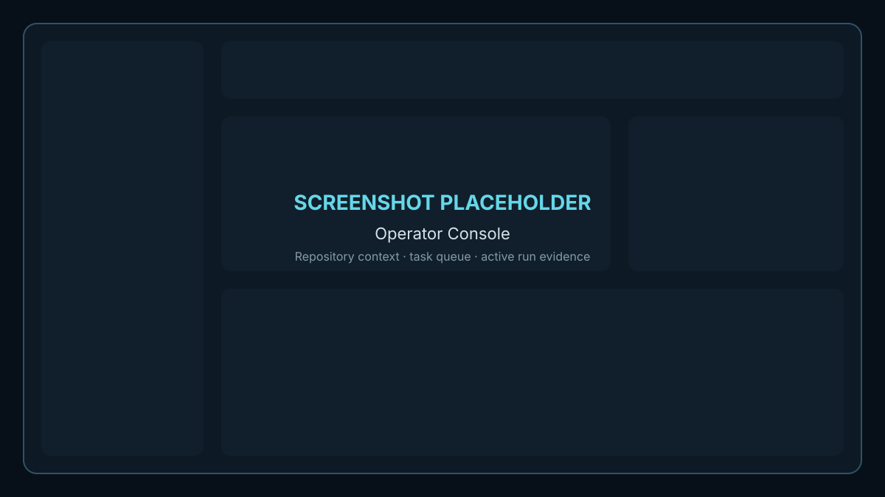
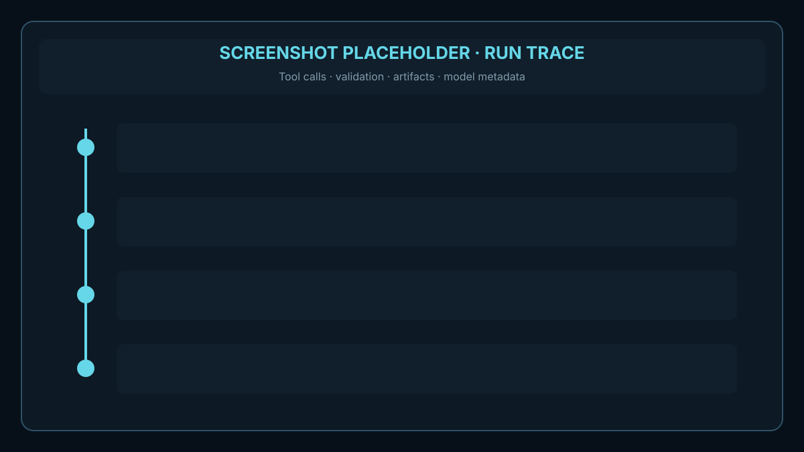
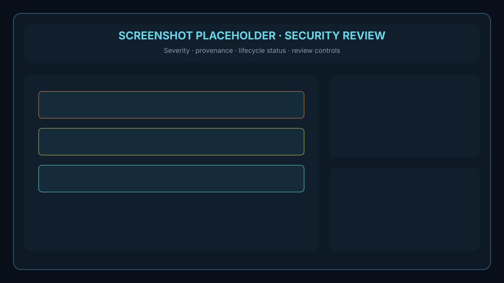

# RepoPilot

[](https://github.com/HarshalRane04/RepoPilot/actions/workflows/ci.yml)
[](LICENSE)
[](apps/api/Dockerfile)
[](apps/web/Dockerfile)

## Brief Description

RepoPilot is a local-first, single-tenant GitHub App control plane for human-approved issue triage, implementation planning, agent execution, validation, security review, and gated draft pull requests.

The system combines a FastAPI API, Next.js operator console, PostgreSQL with pgvector, Redis/Celery workers, and an isolated sandbox service. GitHub writes are disabled by default. Live model calls, source transfer, implementation, and pull-request creation require explicit configuration and policy gates.

> **Project status:** the local control plane and mock-first workflow are implemented. Live-provider quality, credentialed GitHub writes, and production deployment evidence must be validated in the target environment before production use. RepoPilot does not merge pull requests autonomously.

## Features

- **Operator console:** manage repositories, tasks, plans, runs, pull requests, security findings, evaluations, audit records, and runtime settings.
- **Human approval gates:** require approved plans before implementation or GitHub write operations.
- **Agent tool boundary:** route model actions through typed, permissioned, audited tools instead of arbitrary functions or shell access.
- **Repository context:** acquire repositories safely, index source, and retrieve bounded lexical/vector context with citations.
- **Isolated execution:** run allowlisted commands in authenticated, network-disabled sandbox workspaces with resource limits.
- **Evidence-based review:** bind validation and security evidence to the current patch before a run can advance.
- **GitHub integration:** support OAuth, GitHub App installations, signed webhooks, repository sync, CI evidence, and gated draft pull requests.
- **Provider-aware model routing:** validate models dynamically and bind encrypted API keys to the selected provider.
- **Auditability:** record state transitions, tool calls, artifacts, model traces, validation results, security findings, and pull-request actions.
- **Evaluation and release tooling:** provide fixture-backed evals, readiness checks, source-boundary scans, deployment validation, and security posture reports.

## Architecture

| Component | Technology | Responsibility |
| --- | --- | --- |
| Operator console | Next.js 16, React 19, TypeScript | Human review, configuration, evidence inspection, and workflow control |
| API | FastAPI, Pydantic, SQLAlchemy | Authentication, orchestration, policy enforcement, contracts, and GitHub/model integration |
| Database | PostgreSQL 16, pgvector, Alembic | Durable workflow state, audit records, artifacts, and repository embeddings |
| Queue | Redis, Celery | Asynchronous ingestion, implementation, validation, and reconciliation |
| Sandbox | Isolated Python service and Docker runtime | Authenticated, allowlisted, resource-bounded command execution |
| Integrations | GitHub App/OAuth and provider adapters | Repository events, draft pull requests, model calls, and CI evidence |

Runtime code lives in `apps/api`, `apps/web`, `packages`, and `services/sandbox_runner`. See [Architecture](Docs/ARCHITECTURE.md) for component boundaries and [Security](Docs/SECURITY.md) for the threat model.

## Installation

### Prerequisites

- Docker Desktop or a compatible Docker Engine with Compose
- Git
- GNU Make
- A POSIX-compatible shell
- Optional for host-side tooling: Python 3.12, Node.js 22, `uv`, `curl`, and `jq`

### Local installation

```bash
git clone https://github.com/HarshalRane04/RepoPilot.git
cd RepoPilot
make start-local
```

`make start-local` creates local-safe configuration, builds and starts the Compose stack, and applies database migrations.

Open:

- Operator console: [http://localhost:3001](http://localhost:3001)
- API health: [http://localhost:8000/health](http://localhost:8000/health)
- API readiness: [http://localhost:8000/ready](http://localhost:8000/ready)
- OpenAPI documentation: [http://localhost:8000/docs](http://localhost:8000/docs)

For a step-by-step setup, published-container instructions, and credentialed smoke-test order, see the [Self-Hosted Quickstart](Docs/QUICKSTART.md).

### Configuration

The generated `.env` file contains local service wiring only and is excluded from Git. Save GitHub and model-provider credentials through **Settings** in the operator console or through the encrypted runtime-secret helper:

```bash
make configure-runtime-secrets
```

Important defaults:

- `GITHUB_WRITES_ENABLED=false`
- `ALLOW_MODEL_FALLBACK=false` outside local development
- `EMBEDDING_SOURCE_TRANSFER_ENABLED=false`
- runtime secrets stored under the ignored `.local/repopilot-secrets/` directory

Use an external secret manager and `REPOPILOT_RELEASE_PROFILE=production` for non-local deployments. Never commit `.env`, provider keys, GitHub private keys, session secrets, or runtime-secret stores.

## Usage

### Operator workflow

1. Configure a model provider and GitHub integration in **Settings**.
2. Connect or select a repository.
3. Create a task from the operator console or ingest a supported GitHub issue event.
4. Review the generated plan and approve, reject, or request a revision.
5. Start the approved run.
6. Inspect tool calls, patch provenance, validation output, security findings, and CI evidence.
7. Create a draft pull request only after required gates pass.

The intended lifecycle is:

```text
issue
  -> triage
  -> retrieve context
  -> generate plan
  -> human approval
  -> isolated implementation
  -> validation
  -> security review
  -> draft pull request
```

### Common commands

| Command | Purpose |
| --- | --- |
| `make start-local` | Initialize and start the local stack |
| `make logs` | Follow Compose service logs |
| `make down` | Stop the local stack |
| `make migrate` | Apply database migrations |
| `make api-test` | Run the API test suite |
| `make api-lint` | Run Ruff across Python source and tests |
| `pnpm -C apps/web test` | Run frontend regression tests |
| `pnpm -C apps/web typecheck` | Run TypeScript validation |
| `make web-build` | Build the production web image |
| `make readiness-snapshot` | Generate a redacted readiness report |
| `make deployment-validate` | Validate deployment topology and documentation |
| `make release-verify` | Run the strict credentialed release gate |

## Gallery

The committed placeholders identify the screenshots required for public documentation. Replace each SVG at the same path with a current application capture before a tagged public release.

### Operator Console



_Capture the dashboard with repository context, task status, and active-run evidence visible._

### Run Trace



_Capture the trace timeline with tool calls, validation evidence, artifacts, and model metadata._

### Security Review



_Capture finding severity, patch provenance, review status, and the available lifecycle actions._

## Safety Model

RepoPilot is designed around the following invariants:

- No autonomous merges.
- No implementation before human plan approval.
- No unrestricted shell or arbitrary function access for models.
- No generated code applied outside isolated run workspaces.
- No GitHub writes without credentials, explicit write mode, authorization, validation evidence, and security gates.
- No implicit repository-source transfer to embedding providers.
- Every privileged action is attributable through audit and trace records.

Review [Docs/SECURITY.md](Docs/SECURITY.md) before enabling live providers or GitHub writes.

## Validation

Run the local validation set before opening a pull request:

```bash
docker compose config --quiet
make api-test
make api-lint
pnpm -C apps/web test
pnpm -C apps/web typecheck
python3 scripts/ui_truth_guard.py
python3 scripts/deployment_validate.py
python3 scripts/release_hygiene.py --allow-warnings
make web-build
make sandbox-image
```

Credentialed release environments should also run:

```bash
make release-verify
```

## Documentation

- [Documentation index](Docs/README.md)
- [Self-hosted quickstart](Docs/QUICKSTART.md)
- [Architecture](Docs/ARCHITECTURE.md)
- [GitHub App setup](Docs/GITHUB_APP_SETUP.md)
- [Model testing](Docs/MODEL_TESTING.md)
- [Runbook](Docs/RUNBOOK.md)
- [Deployment guide](Docs/DEPLOYMENT_GUIDE.md)
- [Roadmap](Docs/ROADMAP.md)
- [Release checklist](Docs/RELEASE_CHECKLIST.md)

## Contributing

Read [CONTRIBUTING.md](CONTRIBUTING.md) and [CODE_OF_CONDUCT.md](CODE_OF_CONDUCT.md) before submitting changes.

Contributions must:

1. Keep behavior changes scoped and documented.
2. Add or update regression tests.
3. Preserve human approval, policy, sandbox, and audit boundaries.
4. Avoid committing secrets, generated artifacts, or local runtime state.
5. Pass the validation commands above.

## License

RepoPilot is available under the [MIT License](LICENSE).
